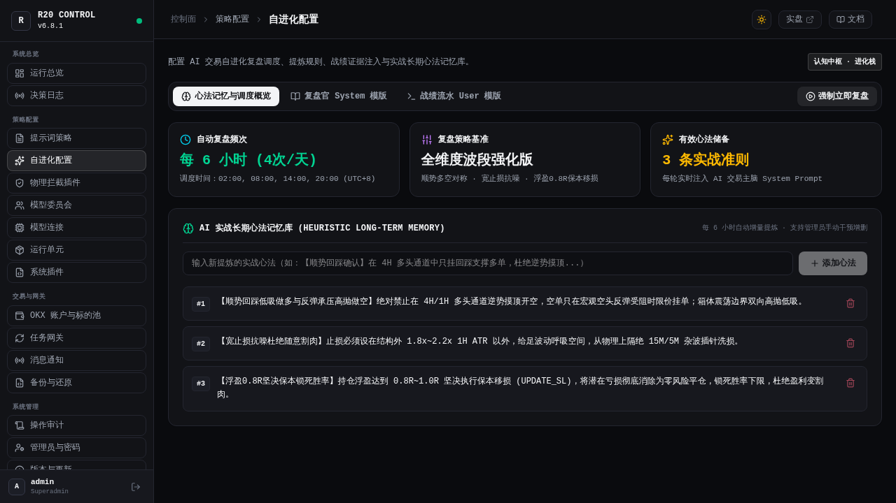
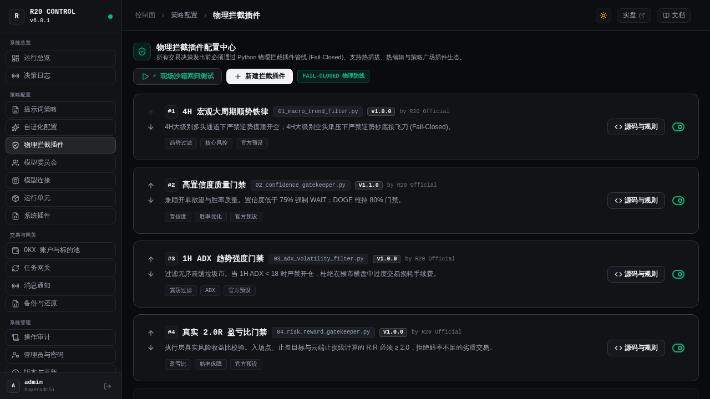
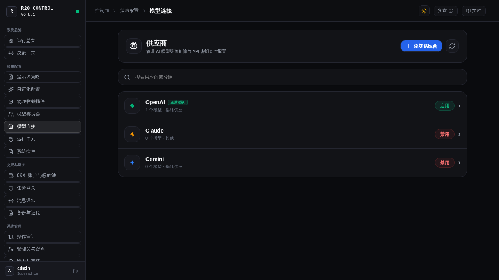

<div align="center">

# ⚡ R20 Quantum Trader

### 面向 OKX 永续合约的机构级 LLM 原生量化交易终端与多模型参谋系统

**多模型决策委员会 · 动态标的资产池 · Python 物理拦截管线 · 启发式自进化记忆 · 原生 Vue 3 双模终端 · 100% 交易所云端 OCO**

[-3875F6?style=flat-square)](https://github.com/555cute/r20-quantum-trader/releases/tag/v7.0.0)
[](https://linux.do/)
[](https://www.python.org/)
[](https://www.okx.com/)
[](#-测试与质量保障)
[](#-企业级安全与防护体系)
[](LICENSE)

[🌐 在线实盘大屏](https://www.r20.cn/) · [📖 官方图文开发指南](/docs) · [🚀 快速部署手册](#-极速部署指南) · [🐧 LINUX DO 社区](https://linux.do/)

<br/>

> 💬 **QQ 官方交流群**：**`655973677`** ｜ **作者 QQ**：`1090188816` ｜ 欢迎进群交流量化模型、提示词编写、微积分动力学因子与实盘动态！

</div>

---


> [!WARNING]
> R20 Quantum Trader 是面向加密货币市场的开源量化交易系统，致力于为个人交易员与量化团队提供高透明度、自进化与工业级的波段交易底座。**软件不构成任何投资建议，数字资产交易具有极高波动风险**。强烈建议先在 OKX **DEMO 模拟盘** 环境下完成全流程回测与沙箱验证，再评估实盘接入。

---

## 🌟 系统核心亮点 (v7.0.0 全面升级)

- 🧠 **全新高胜率多空对称提示词策略**：针对历史频繁割肉彻底纠偏！重塑 1.8x~2.2x 1H ATR 宽容抗噪止损，宁可降杠杆也杜绝 15M 杂波扫损；植入 **0.8R 浮盈保本移损（BE）锁死机制**，杜绝盈利单回吐成亏损；顺势回踩低吸做多与反弹承压高抛做空对称执行，破除无序空仓，自信激发开单欲望。
- 🧬 **自进化系统独立化与 6 小时高速复盘**：从提示词策略中完整拆分出独立的「自进化配置」模块！复盘频次由每日 1 次全面提升至**每日 4 次（每 6 小时：02:00、08:00、14:00、20:00）全自动穿透复盘**；后台支持对启发式实战心法记忆进行增删查改（CRUD），实时动态注入推演 System Prompt。
- 🛡️ **Python 原生物理拦截插件管线（Fail-Closed Hard Risk Interceptors）**：执行层绝对物理防线！4H 顺势铁律（逆势强制否决）、单笔风险几何 $R:R \ge 2.0$ 强校验、75% 置信度基准门禁、震荡市 ADX 过滤；支持自定义 Python 插件热插拔、AST 语法静态校验与现场沙箱回归回放。
- 🏛️ **多模型参谋决策委员会（Council Pro）**：告别单一模型决策幻觉！支持 N 席位多模型并发辩论博弈（动量进攻官、极端风控官、量化数理官、舆情侦察官、宏观策略官、盘口微结构官），支持全动态席位指派、继承各模型专属思考推演强度，由首席终审官收敛输出。
- 🔌 **精炼三基础模型连接与动态模型探测**：精简去除冗余预设，仅保留 OpenAI、Claude、Gemini 三大基础渠道，支持任意自定义供应商扩充；支持免二次密钥输入秒级动态拉取供应商 400+ 远程模型；思考推演强度（`high`/`medium`/`low`，及 gpt-6 自适应 `xhigh`/`max`）收敛至模型实体。
- 💾 **企业级备份、下载与一键全量安全恢复**：备份系统全面重构！支持本地/云端全量数据灾备；支持后台一键打包流式下载 `.tar.gz` 归档文件；支持上传本地外部备份压缩包；支持输入二次安全确认码一键全量恢复还原历史数据与策略，内置严密的路径穿越防御。
- 🖥️ **宽屏显示器自适应排版优化**：彻底修复宽屏下卡片悬浮错位，大屏主页重塑为标准全景流线布局（`stacked`），资产动力学雷达自适应 6 列横向自然铺满，沉浸平整；根治前端与 API 本地强缓存残留，实现秒级热更新。

---

## 📸 核心核心功能界面一览

### 1. ⌘ 提示词策略方案工作室（Prompt Studio）
*聚焦交易主脑核心管线！自进化部分拆离后更加专注纯粹，专注于「交易 System 规则纪律」与「交易 User 实时行情快照拼装」；内置变量快速插入条与变量字典手册，支持将策略一键导出为 JSON 分享或导入社区策略包；右侧提供「实发效果」与「模板源码」毫秒级双模对照。*


---

### 2. 🧬 独立的 AI 自进化认知中枢（Evolution Engine）
*从提示词策略中完整剥离成独立的「自进化配置」中枢。涵盖复盘官 System 角色定位、战绩证据 User 模版；直观监控每 6 小时（每日 4 次）自动复盘计划；内置实战长期心法记忆库，支持管理员直接在后台一键新增心得、删除无效规则，并提供「强制立即复盘」即时提炼。*



---

### 3. 🛡️ 物理拦截插件中心（Interceptors Safety Pipeline）
*代码级执行前硬阻断！所有进入 OKX 交易所的发单指令必须通过顺序链式拦截器，任一插件判定 REJECT 则立即终止交易执行。已优化 75% 置信度基准门禁与 4H 宏观顺势铁律，支持现场沙箱测试，可直接载入最近推演决策回放执行并生成审计报告。*



---

### 4. 🏛️ 多模型决策委员会（Council Pro）
*支持多参谋多线程并发辩论博弈：**动量进攻官**（寻找 Alpha 突破）、**保守风控官**（量价背离与一票否决权）、**量化数理官**（ADX/微积分纯数学门禁）、**舆情侦察官**、**宏观策略官**与**盘口微结构官**各司其职，最终由**首席终审仲裁官**权衡收口。支持席位动态增删、全量动态模型自由绑定与思考深度自动继承。*


---

### 5. 🔌 模型连接与供应商矩阵（LLM Connections）
*极简且强大的模型接入体系：仅保留 OpenAI、Claude、Gemini 三大基础渠道，支持任意自定义供应商扩展；采用真实 API 通信协议下拉矩阵（OpenAI Chat / Responses / Claude Messages 等）；自动继承已存凭据秒级拉取远程 400+ 模型；针对前沿旗舰模型自适应开放 xhigh / max 极限推演。*



---

### 6. 机构级实盘监控大屏（Frontend Workstation）
*全新单行沉浸顶栏，四大财务 HUD 核心指标卡解耦直连；100% 全宽展开在途持仓明细（双行排版清晰舒展、云端止损盾牌与浮盈 ROI 实时透视）；在途 Maker 限价挂单监控与六币因果动力学微结构矩阵横向自适应平整铺满。*


---

## 🏗️ 系统全景架构设计

```
┌────────────────────────────────────────────────────────────────────────┐
│                        R20 QUANTUM TRADER 体系全景                      │
├────────────────────────────────────────────────────────────────────────┤
│ 【数据层】                                                              │
│  • OKX V5 官方 REST/WebSocket 原生行情与私有仓位                        │
│  • 全网突发资讯与要闻情绪倾向采集器 (news_sentiment_harvester)           │
│  • 因果动力学速度/加速度/加加速度 (v, a, j) + 定积分能量储备 (E, A)       │
│  • 经典量化五大因子库：OBV 资金流向 / VWAP 乖离率 / ATR(14) / RSI / ADX  │
├────────────────────────────────────────────────────────────────────────┤
│ 【智能决策中枢】                                                        │
│  • 提示词策略：多空对称顺势 + 1.8~2.2x ATR 抗噪宽止损 + 0.8R 浮盈保本移损 │
│  • 模型委员会：N 参谋席位并发辩论 + 长思考链交叉审视 + 首席仲裁统一收口     │
│  • 自进化认知：每 6 小时自动复盘 (02:00/08:00/14:00/20:00) + 后台心法CRUD │
│  • 供应商网关：OpenAI / Gemini / Claude 核心渠道 + 动态拉取 + 协议解耦   │
├────────────────────────────────────────────────────────────────────────┤
│ 【执行与风控防线】(Fail-Closed 物理硬阻断)                              │
│  • 物理拦截管线：4H顺势铁律 / 75%置信度门禁 / ADX震荡熔断 / 2.0R几何保护 │
│  • 交易执行层：Maker 限价挂单入场 + 动态撤重挂 + 100% 交易所云端 OCO   │
│  • 灾备与恢复：备份包本地打包下载 / 外部归档上传 / 一键安全全量恢复     │
├────────────────────────────────────────────────────────────────────────┤
│ 【控制面与监控展现】                                                    │
│  • 前端：Vue 3 + Vite + Tailwind CSS 纯静态轻量 SPA (宽屏横向6列铺满)   │
│  • 缓存机制：HTML 入口 no-cache 直连，数据轮询时间戳防脏读，CF 边缘加速 │
│  • 后台：FastAPI 异步控制面 + PBKDF2-SHA256 账号认证 + 全量操作审计     │
│  • 多渠道告警：企业微信 / Telegram (反代) / QQ 官方机器人 / 通用 Webhook │
└────────────────────────────────────────────────────────────────────────┘
```

---

## 🔒 企业级安全与防护体系

1. **账户鉴权与恒定时间比对**：
   - 管理后台基于安全会话机制，弃用不安全的通用静态明文 Header。
   - 所有登录认证与密码核验强制采用 `hmac.compare_digest` 恒定时间比对，彻底免疫针对登录接口的时序攻击（Timing Attack）。
2. **私有账本与资产数据防泄露**：
   - `/api/v1/cache/ledger` 包含历史交易收益与平仓台账，强制挂载 `require_admin_header` 鉴权门禁，严禁公开匿名调取。
   - 包含敏感信息的 API 端点全部下发 `Cache-Control: private, no-cache, no-store, must-revalidate`，杜绝 Cloudflare 或任何中间代理节点意外缓存私人交易隐私。
3. **Webhook 凭证与敏感环境变量自动掩码**：
   - 飞书、钉钉、企业微信、Telegram、Discord 及 QQ 机器人的 Webhook 地址在控制台与接口返回时，系统自动执行不可逆安全掩码（如 `https://qyapi.weixin.qq.com/...***MASKED***`），杜绝开发者截屏泄露。
4. **路径穿越防护（Path Traversal Hardening）**：
   - 拦截器文件名与备份恢复归档路径严格限制为文件名本身，校验任何带有绝对路径、`../`、`..\\` 的非法请求并直接抛出 400 阻断。
5. **Fail-Closed 交易所 OCO 终极兜底**：
   - 开仓即挂设交易所原生云端条件单（Take-Profit / Stop-Loss）。若云端 OCO 挂单缺失或网络故障无法修复，系统执行器坚决触发 **Fail-Closed 安全平仓**，绝不在没有止损保护的情况下暴露裸头寸。

---

## 🧪 测试与质量保障

系统配套有高覆盖度的全栈回归测试集，覆盖数学微积分因果律、多因子量化、多模型委员会、提示词编排、API 鉴权、物理拦截沙箱、备份恢复与网关调度：

```bash
# 执行全量单元与系统回归测试
python3 -m unittest discover -s tests -p "test_*.py"
```

**测试通过状态：`167 / 167 Passed` (100% 通过率)**

---

## 🚀 极速部署指南

### 环境依赖
- Linux 服务器 (Debian 11+ / Ubuntu 22.04+ 推荐)
- Python 3.10+
- Node.js 18+ (仅用于前端二次构建，直接运行生产包无需 Node 环境)

### 1. 克隆代码仓库
```bash
git clone https://github.com/555cute/r20-quantum-trader.git
cd r20-quantum-trader
```

### 2. 初始化 Python 虚拟环境并安装依赖
```bash
python3 -m venv venv
source venv/bin/activate
pip install -r requirements.txt
```

### 3. 配置核心环境变量
复制 `.env.example` 为 `.env`，填入您的 OKX API 与 大模型 API 密钥：
```bash
cp .env.example .env
vim .env
```
主要变量说明：
- `OKX_API_KEY` / `OKX_SECRET_KEY` / `OKX_PASSPHRASE`：OKX 官方 API 凭据
- `OKX_SIMULATED`：`1` 为 DEMO 模拟盘，`0` 为真实盘
- `LLM_BASE_URL` / `LLM_API_KEY`：默认大语言模型接口与密钥

### 4. 启动控制台与交易调度
```bash
# 启动 FastAPI 控制面服务 (默认监听 8080 端口)
uvicorn r20_backend.app:app --host 0.0.0.0 --port 8080

# 启动多任务网关调度器 (负责 15M 巡检与每 6 小时自进化复盘)
python3 r20_gateway/worker.py
```

访问浏览器 `http://你的服务器IP:8080/` 即可进入实盘监控终端；访问 `/admin` 登录管理控制台。

---

## 📄 开源许可证

本项目基于 [MIT License](LICENSE) 开源协议分发与使用。
