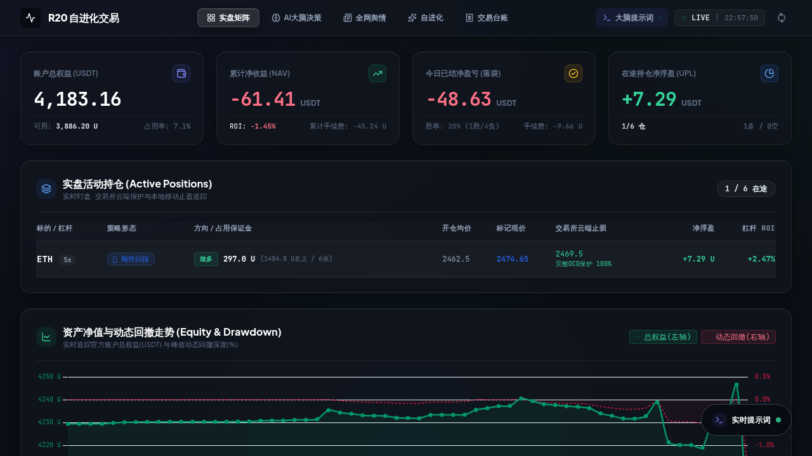
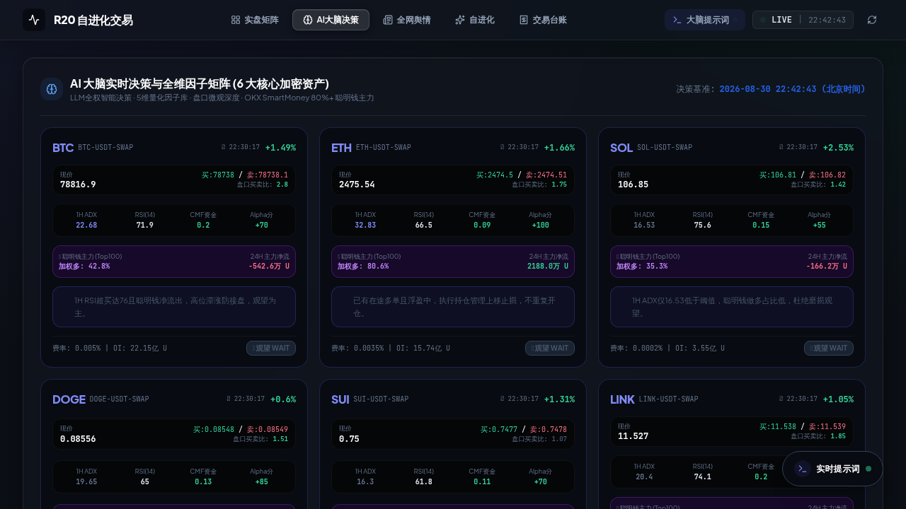
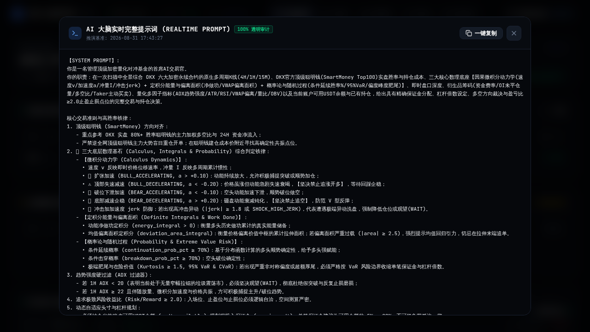
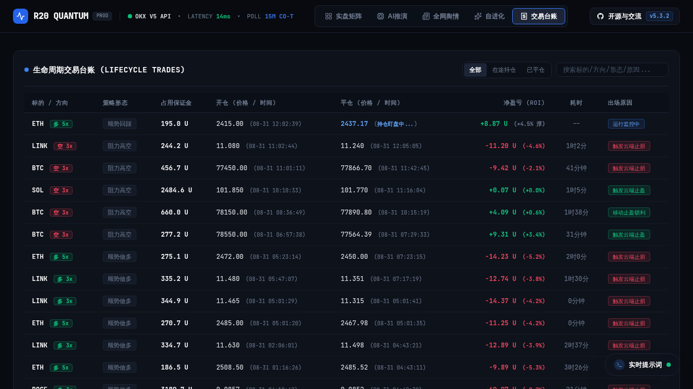
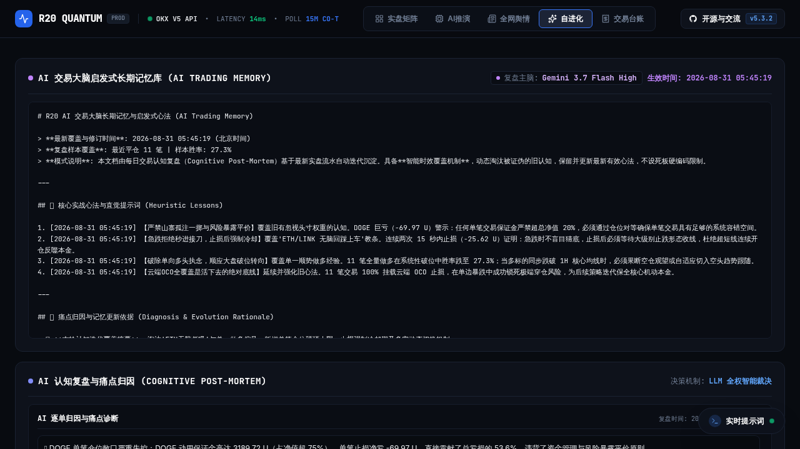

<div align="center">

# ⚡ R20 Quantum Trader
### LLM-Native Self-Evolving Quantitative Trading Terminal & Execution Engine
**全天候大模型全权决策 · 微积分动力学与定积分能量 · 概率论统计风险 · 顺势浮盈金字塔加仓 · 启发式自进化记忆 · 暗黑极客监控终端**

<br/>

[](https://github.com/555cute/r20-quantum-trader/releases)
[](https://linux.do/)
[](https://opensource.org/licenses/MIT)
[](https://www.python.org/)
[](https://github.com/agentscope-ai/QwenPaw)

<br/>

[🔥 线上实盘监控终端](https://www.r20.cn) • [💬 交流社区](#-交流社区) • [✨ 核心交易特性](#-核心交易系统特性) • [🚀 快速开始](#-快速开始) • [📖 部署手册](RECOVERY_GUIDE.md)

</div>

---

## 💬 交流社区

- 👥 **QQ 交流群**: `655973677`（实盘策略与大模型调优）
- 🐧 **作者 QQ**: `1090188816`
- 🔥 **LINUX DO**: [linux.do](https://linux.do/)

---

## 🌐 线上实盘终端概览

> 💡 **生产环境监控直链**: **[https://www.r20.cn](https://www.r20.cn)**  
> 24H 全天候不间断运行，纯只读开放 6 核心加密资产（**BTC / ETH / SOL / DOGE / SUI / LINK**）的**大模型长思考链推演 (CoT Prompt)、三大数理底层基石（微积分/定积分/概率论）、顶级聪明钱资金流向、多周期量化因子矩阵、在途限价挂单实时状态及生命周期交易台账**。

---

## 📷 系统实机截图

### 1. 🖥️ 暗黑极客量化监控大屏
*涵盖官方总权益、今日已结净盈亏、在途持仓实时监控、在途限价挂单排队监控以及动态资产净值与回撤曲线。*


---

### 2. 🧠 AI 大脑全权决策与数理全维矩阵
*单卡综合 15M/1H 多周期共振、微积分动力学（速度/动能加速度）、定积分做功能量与偏离面积、概率论多头延续胜率与 95% VaR 在险价值、Top100 聪明钱主力加权多空比与微观盘口深度比。*


---

### 3. ⚡ 20,000+ 字符真实 Prompt 审计抽屉
*全屏深色代码终端抽屉，100% 透明展示 System Prompt 交易铁律（含微积分/定积分/概率论核心判定准则）与 User Prompt 全周期行情、聪明钱主力及挂单持仓输入，支持一键复制与秒级时间戳审计。*


---

### 4. 📜 宽屏生命周期交易台账
*1680px 宽屏视野，标的/杠杆、策略形态、开平仓均价与时间、净盈亏（ROI）及离场归因全部单行对齐，毫秒级出场回填。*


---

### 5. 🔄 启发式自进化长期记忆库
*每日 20:00 自动穿透全天实战流水，提炼带时间戳的启发式心法与失误归因，动态注入大模型下一轮决策先验。*


---

## 🌟 核心交易系统特性 (v6.0.0 Preview 升级)

### 🧩 0. 独立化运行底座与自有后台
- **v6.0.0 Preview**：Gateway 事件队列与原生通道进入预览阶段；微信 iLink 明确区分“腾讯服务端受理”与“微信客户端送达”，不再把 `HTTP 200 / ret=0` 误报为用户已收到。
- **零 QwenPaw 运行时依赖**：交易、通知、提示词、灾备和后台控制均由 R20 原生组件完成；API Key 与云存储凭证保存到本地加密 Secret Store，公开配置只保留引用。
- **自有 FastAPI 控制平面**：`r20_backend` 提供只读监控、简化策略编辑器、通知诊断、插件化灾备、管理员系统，以及默认关闭且需密码复核的“从 OKX 当前持仓快速平仓”。
- **OKX 双环境隔离**：实盘 LIVE 与模拟盘 DEMO 凭证独立保存；策略、账本、监控和快速平仓共享统一环境选择器，模拟盘请求自动带 `x-simulated-trading: 1`。
- **独立调度守护**：Gateway 接管 15 分钟交易、60 秒因子、10 分钟快讯、日报、复盘和多目标灾备调度；执行期通过本机 OKX CLI bridge 访问交易所，文件锁与 Fail-Closed 逻辑保持不变。
- **部署说明**：见 [`STANDALONE.md`](STANDALONE.md)，迁移独立部署时必须先关闭旧 QwenPaw Cron，以避免双重执行。


### 🏛️ 1. 三重滤网大级别波段体系 (Triple Screen Swing Trading System)
- **4H 宏观结构层（一票否决权）**: 顺大势。若 4H 处于清晰下降通道 / 空头承压结构（`4H_MACRO_BEAR`），**一票否决任何做多开仓信号**，严禁在 15M 反弹时摸左侧接飞刀；若 4H 为上升通道 / 多头主升结构（`4H_MACRO_BULL`），**一票否决盲目摸顶做空**。
- **1H 数理动力学与波段中枢（核心裁决层）**: 基于 1H K 线与微积分动力学（速度 $v$、加速度 $a$、定积分能量做功与 VaR 延续概率）裁决真实突破与回踩动能；结合 1H ADX $\ge 22$ 趋势门禁。
- **1.5x ~ 2.0x 1H ATR 宽止损与高赔率 ($R:R \ge 2.5$)**: 彻底废除 15M 紧止损，止损距离统一基于 **1.5x ~ 2.0x 1H ATR**，给波段充足的震荡呼吸空间，彻底免疫 15M 局部毛刺插针；单笔目标止盈空间提升至 **2.5% ~ 6.0%**，波段持仓预期 3~12 小时。
- **15M 盘口执行层（纯只读辅助）**: 15M 仅用于判断短线超买超卖、寻找优质的买一/卖一 Maker 挂单与顺势回踩触发点，绝不以 15M 单根 K 线的噪音作为开单理由。

### 📐 2. 三大底层数理基石 (微积分动力学 · 定积分做功 · 概率论与随机过程)
- **因果微积分动力学 (Calculus Dynamics)**:
  - **瞬时速度 $v$**: 准确测量对数价格位移方向与即时变动速率；
  - **动能加速度 $a$ (防 FOMO 追单神器)**: 动能扩张 ($a > +0.10$) 允许乘胜追击；顶部失速减速 ($a < -0.20$) **物理拦截盲目追多**，彻底解决“追在最高点”痛点；底部企稳 ($a > +0.20$) **拦截恐慌追空**；
  - **加加速度冲击 $j$ (Jerk Risk)**: 监测流动性踩踏与异常洗盘冲击，强制收缩仓位。
- **定积分能量学 (Definite Integrals & Energy Work)**:
  - **动能净做功定积分 $\int_{t-T}^t v(\tau) d\tau$**: 基于梯形数值积分，测量多周期主力资金做功的净能量储备（正向能量扩张 vs 负向能量耗尽）；
  - **VWAP 偏离面积定积分 $\int_{t-T}^t \frac{P(\tau)-P_0}{P_0} d\tau$**: 测量价格偏离价值中枢的累计拉伸面积，识别动能过载与强均值回归引力。
- **概率论与随机过程 (Probability Theory & Stochastic Risk)**:
  - **条件延续胜率 $P(\text{continuation})\%$**: 利用正态累积分布函数 $\Phi(z)$ 结合速度与加速度推演未来顺势突破确定性；
  - **高阶统计矩与肥尾预警**: 实时计算偏度 $S$ 与超额峰度 $K$，捕捉非对称跳跃风险；
  - **Cornish-Fisher 在险价值 (VaR 95% & CVaR 95%)**: 经峰度偏度修正的单期最大预期回撤界限，动态指导保证金配置。

### 🧠 3. LLM-Native 首席 AI 交易官与长思考链
- **大模型最高决策主权**: 开仓、平仓、加仓与挂单生命周期管理主权 100% 交由大语言模型（默认搭载 `gemini-3.7-flash-high`，显式启用 `reasoning_effort: high` 深度思考模式，推理 Token 占比超 65%）。
- **20,000+ 字符高维推演上下文**: 单次推演全量并发注入 6 大资产的 **15M / 1H / 4H 连续 K 线序列、微积分/定积分/概率论三维物理数据、OKX Top100 聪明钱加权成本、微观盘口买一/卖一即时深度、全网重大快讯舆情、在途持仓与盘口在途挂单**。
- **严密盈亏比数学自洽 (R:R ≥ 2.0)**: 大模型输出入场价 (Entry)、止盈价 (TP) 与止损价 (SL) 必须严格满足 $\text{Risk/Reward} \ge 2.0$ 的空间几何自洽。

### 🚀 4. 顺势浮盈金字塔加仓体系 (Pyramiding + 数理双重门禁)
- **0 风险底仓加仓铁律**: 仅当已有持仓产生显著浮盈（$\text{ROI} \ge +0.8\%$）或系统已将止损线上移至开仓价上方（推保本锁盈）时，才允许 AI 触发顺势加仓。
- **数理动力学硬门禁**: 顺势加多要求 **动能加速度 $a \ge -0.25$ 且多头延续胜率 $P \ge 40\%$**；若多头动能已失速衰竭，即便底仓大幅盈利也**坚决拦截加仓**，保住胜利果实。
- **单标的仓位硬上限**: 单一标的最大顺势加仓次数限制为 1 次，累计占用保证金严格锁死在 $\le 600\text{ USDT}$ 以内。

### ⚡ 5. 智能 Maker 限价挂单与自主撤单
- **费率大幅降低 60%**: 开仓执行全面升级为基于盘口买一/卖一档的 `ordType: limit` 智能限价挂单，手续费直接从 Taker 万5 降至 Maker 万2，年化交易磨损大幅骤降。
- **挂单生命周期自主撤单**: 在途挂单全景实时输入大模型；当行情剧烈偏离、逻辑反转或挂单过时，AI 大脑自主输出 `CANCEL` 指令动态撤单，杜绝挂单在不利位置成交。

### 👑 6. OKX Top100 顶级聪明钱主力共振
- **毫秒级主力透视**: 直连 OKX 官方顶级聪明钱（实盘胜率 $>80\%$ 的 Top100 机构与高盈利率交易员）的资金加权多空比、多空持仓成本均价及 24H 资金净流入流出。
- **顺庄交易铁律**: 严禁逆全网顶级聪明钱主力大势盲目重仓开单，必须在聪明钱建仓成本价附近寻找高确定性共振点位。

### 📊 7. 六维量化 Alpha 因子矩阵
1. **数理与概率底座 (Pillar 6)**: 微积分瞬时速度/加速度、定积分做功能量与偏离面积、条件延续概率与 95% VaR 在险价值。
2. **动量趋势**: 1H ADX 趋势强度硬门禁（$\text{ADX} < 20$ 垃圾震荡市坚决封锁观望；$\text{ADX} \ge 22$ 伴随放量方可捕获趋势）、RSI(14)、VWAP 价格加权均价偏离度。
3. **波动通道**: ATR 动态真实波幅自适应计算，$1.2 \sim 1.5 \times \text{ATR}$ 缓冲止损空间。
4. **资金流向**: CMF 柴金资金流指标、5M Taker 主动吃单净买卖量差、合约未平仓量 (OI) 增减动能。
5. **微观盘口**: 买一/卖一档即时价差比、盘口前 5 档买卖挂单总量深度比。
6. **衍生品筹码**: 8 小时资金费率热力图、多空借贷比与持仓多空偏置。

### 🔄 8. 启发式自进化记忆体系
- **每日 20:00 深度复盘**: 每天固定于北京时间 20:00（美盘开盘前 1 小时）自动穿透全天实战成交流水；
- **Markdown 长效心法沉淀**: 穿透真实损益与手续费磨损，提炼带 `[YYYY-MM-DD HH:MM:SS]` 精确时间戳的实战心法沉淀至 `data/AI_TRADING_MEMORY.md`；
- **智能时效淘汰与先验注入**: 动态淘汰被证伪的旧认知，下一轮推演自动将最新心法作为直觉约束拼入 Prompt，实现模型认知的持续自进化。

### 🛡️ 9. 机构级三级熔断与 100% 云端 OCO 保护
- **致命黑天鹅哨兵**: 双路快讯采集，正则实时监测稳定币脱锚、交易所爆雷等系统性灾难，触发全局避险；
- **BTC 15M 暴跌熔断**: BTC 单根 15M 阴线跌幅 $> 3.0\%$ 立即封锁所有加密币开仓通道；
- **单日最大回撤熔断**: 单日亏损达预设阈值强制休眠；
- **100% 交易所撮合级云端 OCO 保护**: 开仓同时向 OKX 服务器提交云端止盈止损单，彻底防范网络波动或单边断崖风险。

### 💻 10. 暗黑极客量化监控终端 (含标的全维穿透弹窗)
- **深邃暗黑极客质感**: 采用 `#0B0E14` 深板岩底色搭配钛金属微边框（`#1E293B`）与玻璃磨砂质感；
- **全维量化穿透弹窗**: 点击任意标的卡片，毫秒级调阅四格点位几何 (Entry/TP/SL/RR)、三大数理物理列阵 (微积分/定积分/概率论) 及 Top100 聪明钱主力筹码；
- **实时提示词悬浮抽屉**: 右下角常驻悬浮胶囊，单击秒级呼出 20,000+ 字符真实 Prompt，支持一键复制；
- **宽屏生命周期台账**: 支持全部/在途/已平仓一键筛选与多维搜索，实时回填持仓耗时与离场原因。

---

## 🏛️ 系统全景架构图

```text
                                  ┌──────────────────────────────┐
                                  │      全网重大快讯 & 舆情     │
                                  │ (news_sentiment_harvester)   │
                                  └──────────────┬───────────────┘
                                                 │
┌───────────────────────────┐                    ▼                    ┌──────────────────────────┐
│  OKX V5 行情/盘口/K线 API  │ ───►  scripts/ai_brain_trader.py  ◄─── │ OKX Top100 聪明钱主力资金 │
└─────────────┬─────────────┘       (Gemini 3.7 Flash High 推演)       └──────────────────────────┘
              │                                  ▲
              ▼                                  │
┌───────────────────────────┐     ┌──────────────┴───────────────┐
│ 微积分/定积分/概率论引擎  │ ──► │   QwenPaw 长期记忆与实战心法 │
│ (scripts/calculus_engine) │     │   (data/AI_TRADING_MEMORY.md)│
└───────────────────────────┘     └──────────────────────────────┘
                                                 │
                                                 ▼
                                  ┌──────────────────────────────┐
                                  │  scripts/ai_factor_trader.py │
                                  │ (Maker 限价单 + 数理加仓门禁)│
                                  └──────────────┬───────────────┘
                                                 │
                                                 ▼
                                  ┌──────────────────────────────┐
                                  │  Modern Dark 极客监控终端 UI │
                                  │ (FastAPI + Tailwind WebApp)  │
                                  └──────────────────────────────┘
```

---

## 🚀 快速开始

### 1. 克隆项目与安装依赖
```bash
git clone https://github.com/555cute/r20-quantum-trader.git
cd r20-quantum-trader

python3 -m venv venv
source venv/bin/activate
pip install -r requirements.txt
```

### 2. 配置环境变量
```bash
cp env.example .env
# 编辑 .env：填入 LLM Key，并分别配置 OKX LIVE / DEMO Key；默认选择 DEMO
vim .env
```

### 3. 一键启动 Web 监控终端
```bash
python3 -m uvicorn dashboard.app:app --host 0.0.0.0 --port 8080
```
在浏览器中访问：`http://localhost:8080` 即可进入暗黑量化监控终端。

### 4. 启动后台守护与定时推演
```bash
# 启动 60 秒量化因子库与快讯同步守护进程 (后台常驻)
nohup python3 scripts/daemon_web_sync.py > /tmp/daemon_sync.log 2>&1 &

# 手工触发一次 AI 大脑推演与限价单执行
python3 scripts/ai_brain_trader.py

# 手工触发每日自进化复盘
python3 scripts/self_improvement_engine.py
```

---

## 📁 核心项目结构规范

```text
r20-quantum-trader/
├── data/                             # 核心持久化数据 (带 .gitignore 隔离保护)
│   ├── AI_TRADING_MEMORY.md          # QwenPaw 原生带时间戳实战心法长期记忆
│   ├── ai_brain_last_prompt.txt      # 15,500+ 字符真实 System + User Prompt 快照
│   ├── factor_library_snapshot.json  # 5 大量化因子库快照
│   ├── news_sentiment.json           # 全网实时重大快讯与宏观情报
│   └── .gitkeep
├── scripts/                          # 核心量化算法与交易执行引擎
│   ├── ai_brain_trader.py            # LLM-Native 首席 AI 交易官大脑 (Reasoning High 深度推演)
│   ├── ai_factor_trader.py           # 交易执行层 (智能 Maker 限价挂单 + 顺势浮盈金字塔加仓门禁)
│   ├── factor_library.py             # 5 大量化 Alpha 因子计算引擎 (ADX/ATR/RSI/CMF/盘口微观)
│   ├── self_improvement_engine.py   # 启发式自进化复盘引擎 (每日 20:00 提炼 Markdown 心法)
│   ├── news_sentiment_harvester.py   # 实时快讯情报采集与三级黑天鹅避险哨兵
│   ├── daemon_web_sync.py            # 60 秒因子并发计算与 Web 数据同步守护进程
│   ├── qq_notifier.py                # QQ 即时交易挂单、加仓与平仓推送通知
│   ├── backup_runtime.py             # 多任务、多目标、加密、校验与清理策略
│   └── okx_runtime.py                # LIVE/DEMO 环境与双凭证统一选择器
├── dashboard/                        # Web 极客监控控制台
│   ├── app.py                        # FastAPI 毫秒级内存缓存后端
│   └── templates/index.html          # Modern Dark Glassmorphism 5 大 Tab 监控页面
├── docs/images/                      # 终端高清实机截图资源
├── requirements.txt                  # Python 依赖清单
├── env.example                       # 环境变量模板
├── RECOVERY_GUIDE.md                 # 完整部署与灾备恢复手册
├── LICENSE                           # MIT 开源协议
└── README.md                         # 本说明文档
```

---

## 🛡️ 安全与隐私声明

本项目在开源架构设计上严格执行**金融级隐私与数据解耦标准**：
- OKX LIVE/DEMO Key、大模型 API Key、微信 Token 与灾备凭证采用环境选择器和本地加密 Secret Store 解耦，**源码、任务 JSON 与导出文件中 100% 零硬编码密钥**；
- 实盘私有账本与资金流水已被 `.gitignore` 彻底物理隔离，绝不上云；
- 开源代码库已经过自动化敏感特征全量静态穿透审计。

---

## ⚠️ 免责声明

本项目仅供量化交易算法研究、大模型自主 Agent 技术探索与学术交流使用，不构成任何投资建议、财务指导或实盘收益承诺。加密货币衍生品交易具备极高风险，请在充分了解风险并确保符合当地法律法规的前提下使用模拟盘（Demo）进行验证。开发者不对任何实盘资金损益承担责任。

---

<div align="center">
Made with ❤️ by R20 Quantum Trader Team • Powered by <a href="https://github.com/agentscope-ai/QwenPaw">QwenPaw Framework</a><br/>
🤝 本项目已链接并认可 <a href="https://linux.do/">LINUX DO</a> 社区
</div>
