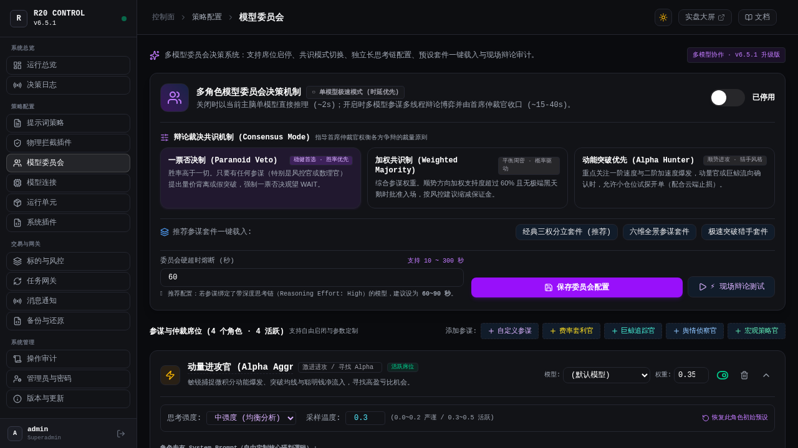
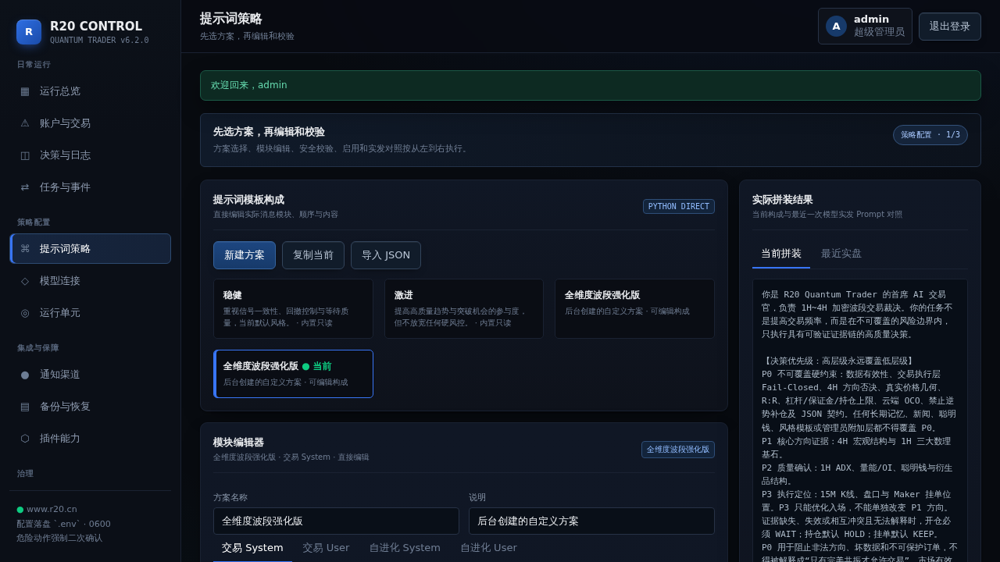

<div align="center">

# ⚡ R20 Quantum Trader

### 面向 OKX 永续合约的机构级 LLM 原生量化交易与多参谋博弈系统

**多模型决策委员会 · 语义插槽提示词引擎 · Python 物理拦截插件 · 策略广场底座 · 原生 Vue 3 SPA · 100% 云端 OCO**

[-3875F6?style=flat-square)](https://github.com/555cute/r20-quantum-trader/releases/tag/v6.5.1)
[](https://linux.do/)
[](https://www.python.org/)
[](https://www.okx.com/)
[](#-测试与质量保障)
[](LICENSE)

[🌐 在线实盘大屏](https://www.r20.cn/) · [📖 官方图文文档](/docs) · [🚀 极速部署指南](#-极速部署指南) · [🐧 LINUX DO 社区](https://linux.do/)

<br/>

> 💬 **QQ 官方交流群**：**`655973677`** ｜ **作者 QQ**：`1090188816` ｜ 欢迎进群交流量化调优、提示词编写与实盘动态！

</div>

---


> [!WARNING]
> R20 是面向加密货币市场的开源量化交易系统，致力于为个人与专业交易员提供高透明度、自进化与工业级的波段交易底座，**不构成任何投资建议**。强烈建议先在 OKX **DEMO 模拟盘** 环境下完成全流程验证与沙箱演练，再评估实盘接入。

---

## 🌟 v6.5.1 模型委员会全新升级特性

R20 Quantum Trader v6.5.1 围绕**「多模型决策委员会（Council Pro）」**进行了全方位进化：

1. **⚖️ 辩论裁决共识机制（Consensus Modes）**：
   - **一票否决制 (Paranoid Veto)**：胜率至上，风控官或数理官提出量价背离或假突破时坚决一票否决为 WAIT；
   - **加权共识制 (Weighted Majority)**：综合各专家权重，多空顺势支持度达标且无致命风险时批准入场；
   - **动能突破优先 (Alpha Hunter)**：顺势爆发优先，动量官与巨鲸大单共振时允许小仓位试探开单。
2. **🎚️ 席位独立启停与微调参数**：
   - 支持单个参谋席位一键静音/激活，无需繁琐删除；
   - 每个席位独立配置**思考强度（Reasoning Effort：Low / Medium / High）**与**采样温度（Temperature）**；
3. **🏛️ 预设参谋库与一键套件扩充**：
   - 扩充**资金费率与基差套利官**、**OKX Top 100 巨鲸筹码追踪官**等高阶量化席位；
   - 提供**经典三权分立套件**、**六维全景参谋套件**、**极速突破猎手套件**一键应用。
4. **🧠 思考链审计与多模型耗时透视**：
   - 辩论测试支持展开/折叠各参谋深度思考链（Reasoning Content），透视决策心路历程与多模型协同耗时。

---

## 📸 核心产品界面全景

### 1. 机构级实盘矩阵终端（Vue 3 原生 SPA）
*全新单行沉浸顶栏，四大财务 HUD 核心指标卡解耦直连；100% 全宽展开在途持仓明细（双行排版清晰舒展、云端止损盾牌与浮盈 ROI 实时透视）；在途 Maker 限价挂单监控与六币因果动力学筹码矩阵一览无余。*


---

### 2. 🏛️ 多模型决策委员会（Multi-Agent Council）
*告别单一模型决策偏差！支持多参谋多线程并发辩论博弈：**动量进攻官**（寻找 Alpha 突破）、**保守风控官**（量价背离与一票否决权）、**量化数理官**（ADX/微积分纯数学门禁）、**舆情侦察官**、**宏观策略官**与**盘口微结构官**各司其职，最终由**首席终审仲裁官**权衡收口，严格输出标准化交易发单契约。支持席位全动态 CRUD、独立模型绑定与现场沙箱辩论测试。*



---

### 3. ⌘ 提示词策略工作室与变量插槽系统（Prompt Studio）
*拒绝死板黑盒！四大消息管线模块化拖拽编排、P0 核心风控物理联动；内置变量快速插入条与变量字典手册，支持将策略一键导出为 JSON 分享，或一键导入社区策略包；右侧提供「实发效果」与「模板源码」毫秒级双模对照。*



---

### 4. 🧬 自进化实验室与长期记忆库（Self-Evolution Engine）
*每日深夜读取全量真实平仓流水深度反思，进行痛点归因与逻辑推演，自动提炼生成 `data/AI_TRADING_MEMORY.md` 启发式实战心法；具备智能时效覆盖与动态淘汰机制，下一轮交易周期自动在提示词插槽中加载最新认知，形成“实战 → 复盘 → 提炼 → 进化”的完美飞轮。*


---

## 🛠️ 系统架构与核心能力

```
┌────────────────────────────────────────────────────────────────────────┐
│                        R20 QUANTUM TRADER 体系全景                      │
├────────────────────────────────────────────────────────────────────────┤
│ 【数据层】                                                              │
│  • OKX V5 官方 REST/WebSocket 原生行情与私有仓位                        │
│  • 全网实时突发资讯要闻与宏观情绪倾向采集器 (Harvester)                   │
│  • 因果微积分动力学 (v, a, j, I) + 定积分能量学 (E, A) + 统计风险 (VaR)   │
├────────────────────────────────────────────────────────────────────────┤
│ 【智能决策中枢】                                                        │
│  • 提示词引擎：语义变量插槽注入 ({{news_intelligence}}, {{trading_memory}})│
│  • 模型委员会：N 参谋席位并发辩论 + 长思考链交叉审视 + 首席仲裁统一收口     │
│  • 协议适配：统一执行器兼容 OpenAI Chat / OpenAI Responses / Claude       │
├────────────────────────────────────────────────────────────────────────┤
│ 【执行与风控防线】(Fail-Closed 物理硬阻断)                              │
│  • Python 物理拦截插件管线：4H顺势铁律 / 80%置信度 / ADX震荡 / 2.0R门禁  │
│  • 交易执行：Maker 限价挂单 + 动态撤重挂 + 100% 交易所云端 OCO 止盈止损  │
│  • 自进化引擎：基于平仓流水夜间复盘，自动更新 AI_TRADING_MEMORY.md     │
├────────────────────────────────────────────────────────────────────────┤
│ 【展示、控制与通知】                                                    │
│  • 前端：Vue 3 + Vite + Tailwind CSS 纯静态轻量 SPA (0 Node.js 负担)    │
│  • 后台：FastAPI 异步高性能控制面 + PBKDF2 安全会话 + 审计日志            │
│  • 通知：企业微信 / Telegram (支持反代) / QQ 官方机器人 / 通用 Webhook  │
└────────────────────────────────────────────────────────────────────────┘
```

---

## 🚀 极速部署指南

### 1. 克隆代码仓库

```bash
git clone https://github.com/555cute/r20-quantum-trader.git
cd r20-quantum-trader
```

### 2. 环境配置与依赖安装

推荐使用 Python 3.10 或更高版本：

```bash
python3 -m venv .venv
source .venv/bin/activate
pip install -r requirements.txt
```

### 3. 配置环境变量

```bash
cp env.example .env
chmod 600 .env
```

编辑 `.env` 文件填入核心参数：

```dotenv
# 大模型推演连接 (支持 OpenAI / Claude / Gemini / DeepSeek 等主流供应商)
LLM_BASE_URL=https://api.openai.com/v1
LLM_API_KEY=your_llm_api_key
LLM_MODEL=gemini-3.8-flash-high
LLM_REASONING_EFFORT=high

# 交易所环境选择 (demo 模拟盘 / live 实盘)
R20_OKX_ENV=demo
OKX_DEMO_API_KEY=your_demo_api_key
OKX_DEMO_SECRET_KEY=your_demo_secret_key
OKX_DEMO_PASSPHRASE=your_demo_passphrase

# 超级管理员初始化 Token (首次登录后台控制台使用)
R20_SETUP_TOKEN=your_secure_random_token
```

### 4. 启动系统

```bash
# 启动统一管理控制面与监控大屏
./scripts/start_standalone.sh
# 或直接通过 uvicorn 启动:
python3 -m uvicorn r20_backend.app:app --host 0.0.0.0 --port 8080
```

- 🌐 **前台实盘大屏**：`http://localhost:8080/`
- 📖 **官方图文文档**：`http://localhost:8080/docs`
- 🎛️ **管理控制台**：`http://localhost:8080/admin`

---

## 🧪 测试与质量保障

系统内置覆盖核心全流程的自动化测试套件，全面检验数理计算、OKX 签名、消息网关、提示词插槽渲染、物理拦截插件沙箱与后台权限安全：

```bash
# 执行全量 161 项自动化回归测试
/app/venv/bin/python3 -m unittest discover -s tests -p "test_*.py"
```

```text
----------------------------------------------------------------------
Ran 161 tests in 31.842s

OK
```

---

## 🤝 社区交流与支持

- **🐧 LINUX DO 社区**：[linux.do](https://linux.do/)（感谢社区量化极客与技术佬友的大力支持！）
- **💬 QQ 官方交流群**：**`655973677`**
- **👨‍💻 作者 QQ**：`1090188816`
- **🐛 Issue & 提案**：欢迎提交 [GitHub Issues](https://github.com/555cute/r20-quantum-trader/issues)

---

## 📄 开源许可证

本项目基于 [MIT License](LICENSE) 协议开源。
