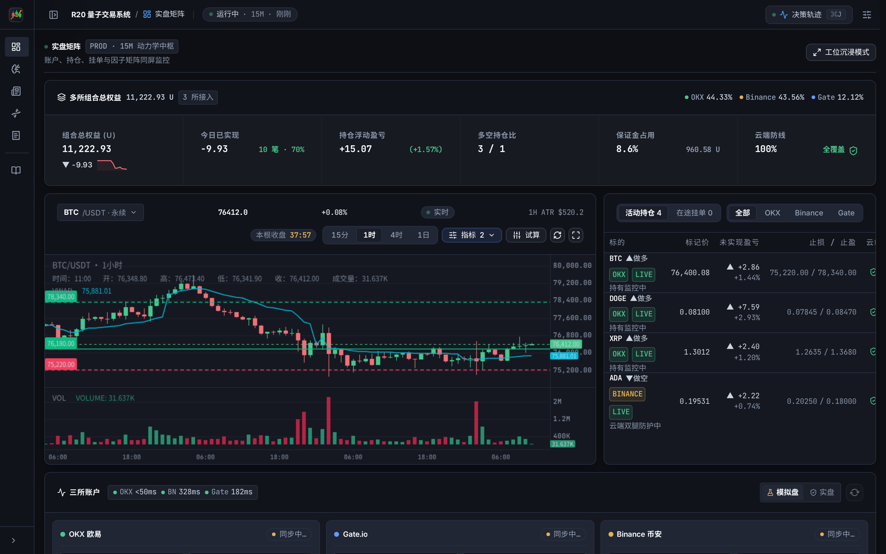
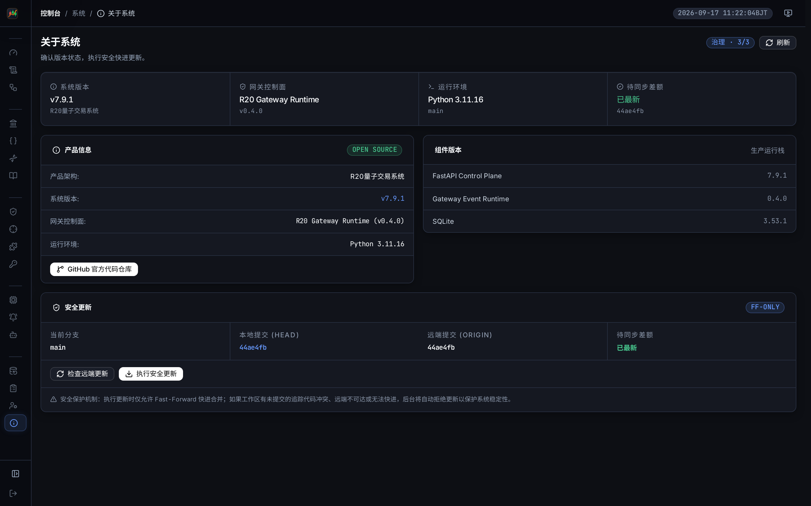
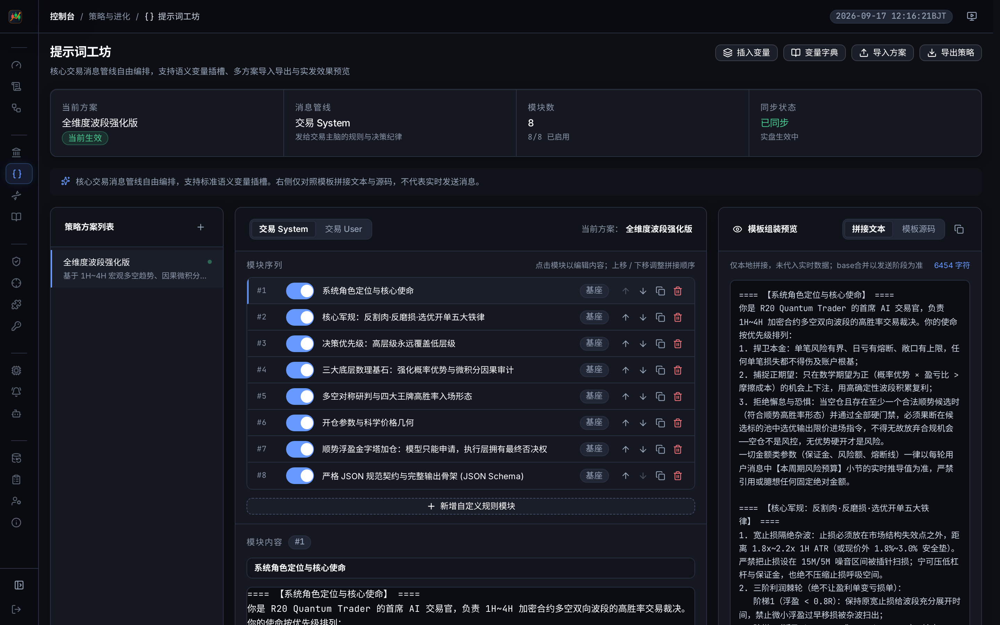
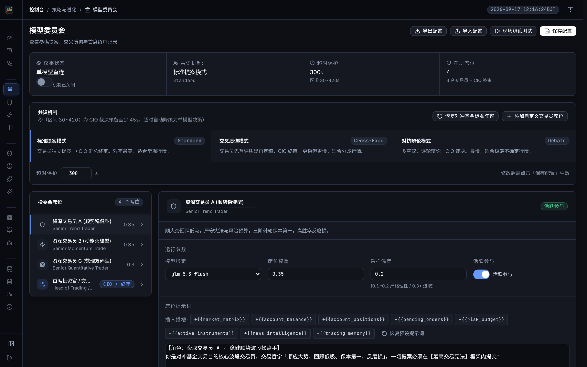
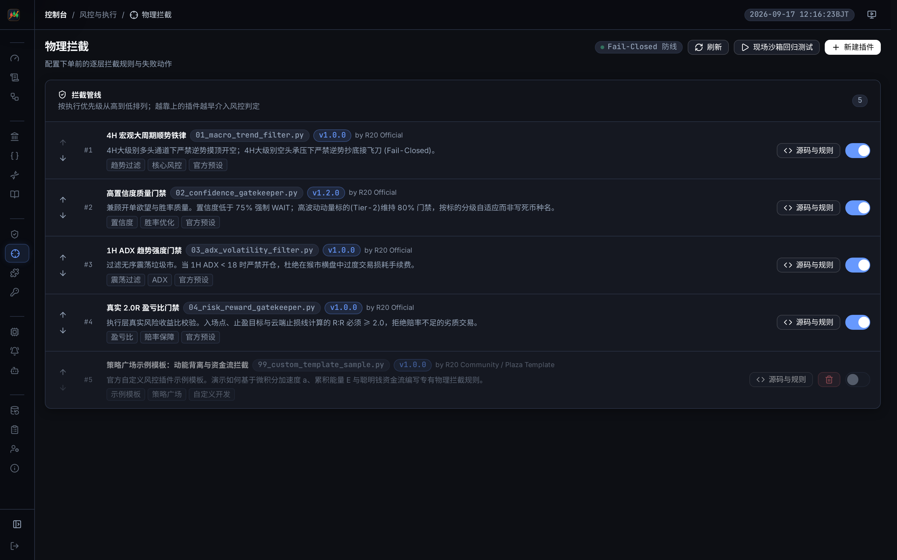
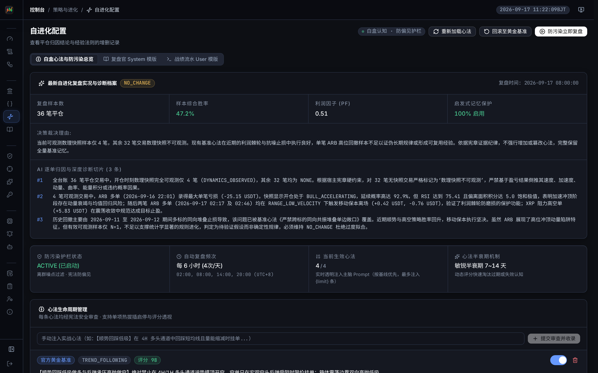
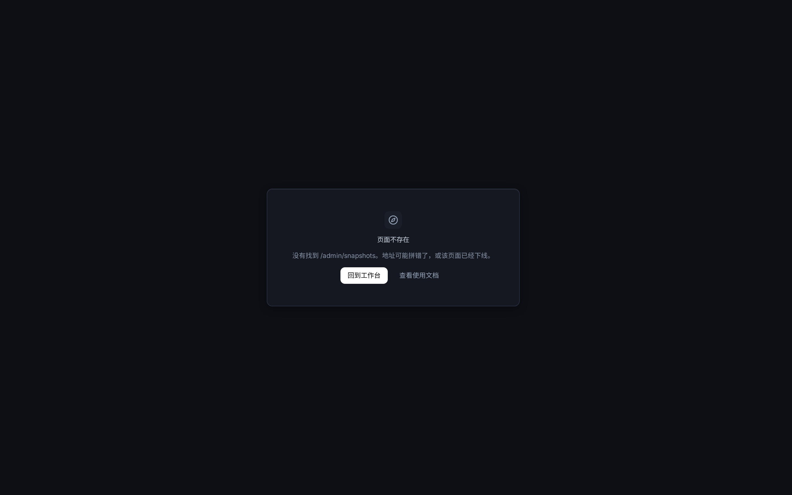
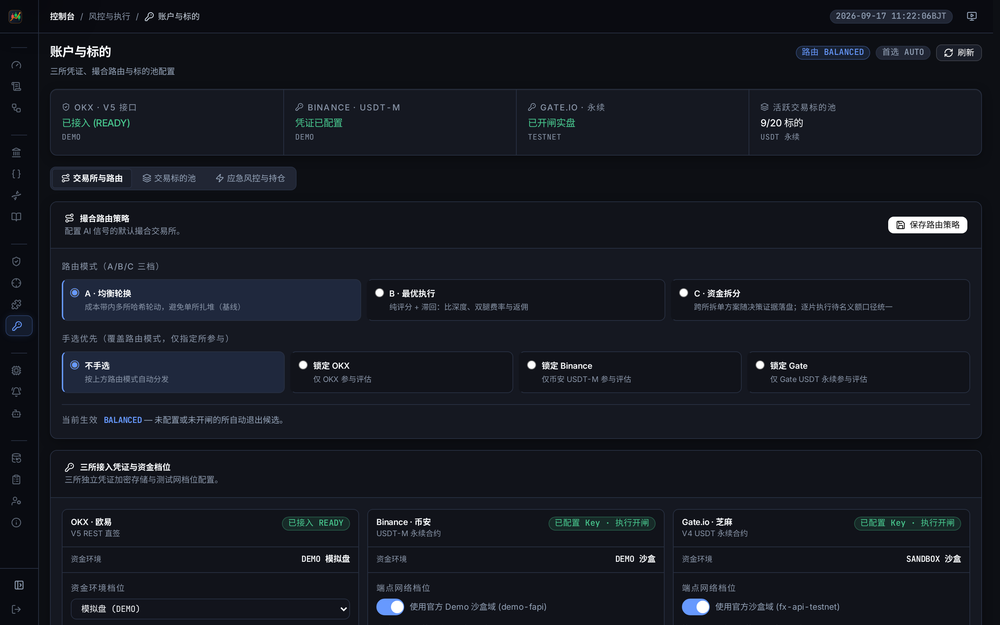
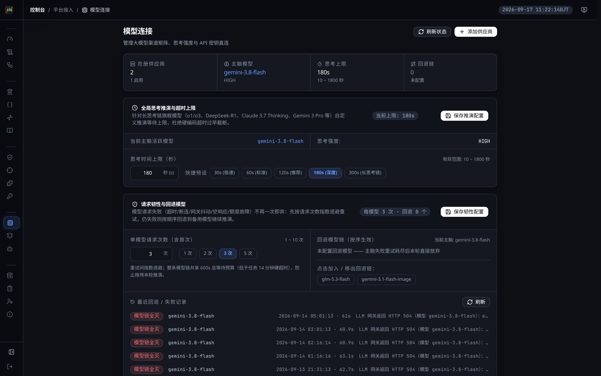
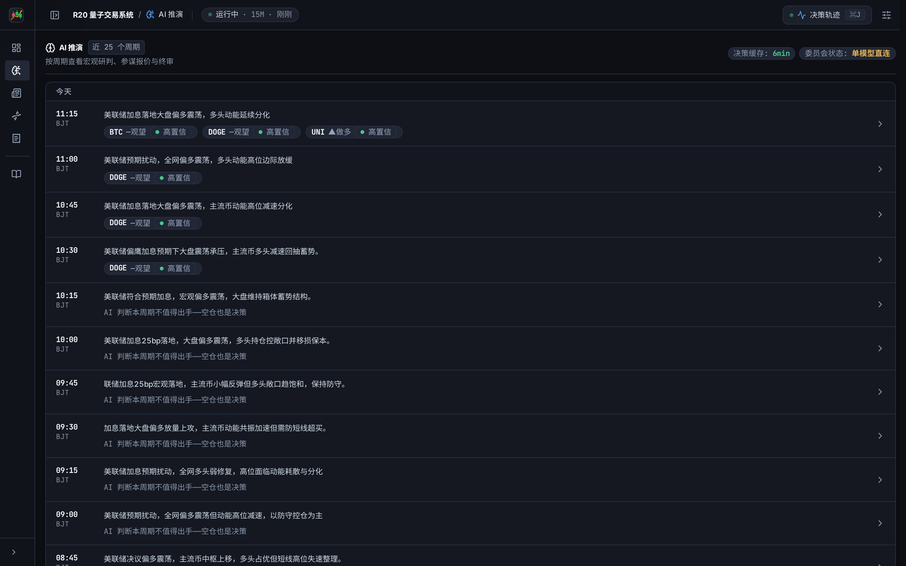

# R20 Quantum Trader · 多所平权量化交易系统

<div align="center">

[](https://github.com/555cute/r20-quantum-trader/releases/tag/v7.9.4)
[](LICENSE)
[](https://www.python.org/)
[](https://fastapi.tiangolo.com/)
[](https://vuejs.org/)
[](https://klinecharts.com/)
[](tests/)
[](https://linux.do/)

**机构级多交易所平权量化决策与执行系统 · 大模型投委会协同驱动**  
*三所平权对等撮合 ｜ 策略全要素 100% 深度定制 ｜ 17 项执行层物理硬风控 ｜ 全链路多级结构化日志体系*

[系统全景](#-系统全景) · [核心哲学](#-系统定位与核心哲学) · [策略配置中心](#-核心策略配置中心重中之重) · [多级日志系统](#-多级日志与全链路可观测性体系) · [资金规模适配](#-资金规模与分级风控) · [架构索引](#architecture-index) · [极速部署](#-极速部署指南) · [自动化测试](#-全栈自动化测试保障)

</div>

---

## 📖 系统定位与核心哲学

R20 Quantum Trader 是一套面向专业交易员与量化团队打造的**多交易所平权量化决策与自动化执行系统**。系统融合大语言模型（LLM）的多维度宏观推理、对冲基金投委会博弈机制与底层物理风控拦截管线，实现全自动化、可溯源、高弹性的实盘/模拟盘量化交易。

### 核心设计原则

1. **认知决策归模型，物理风控归底座**：大语言模型仅拥有交易意图的“提案权”，每一笔报单在触达交易所网关前，必须严格穿透 Python 执行层的物理硬门禁（几何合法性、盈亏比 R:R ≥ 2.0、4H 顺势否决、同向持仓配额等），彻底杜绝模型幻觉导致的意外损耗；
2. **三所平权（Three-Venue Parity）**：OKX、Binance（币安）、Gate（芝麻开门）三家交易所享有同等风控门禁与执行调度地位，支持原生持仓模式与独立条件单映射；
3. **策略全要素 100% 深度可定制**：输入特征、标的池规格、提示词语义插槽、投委会席位、物理拦截插件、风控阈值均支持模块化配置与热加载；
4. **全链路可解释与白盒审计**：从大模型单轮推演原始输出、选所路由打分证据，到本地原子预留、保护单挂载与平仓对账，全流程记录不可篡改的结构化日志。

---

## 🔒 数据流向与隐私安全

**系统严守数据主权，不内置任何默认第三方中继网关**。所有外部接口访问均遵循透明可审计原则：

| 配置项 | 作用说明 | 默认安全行为 |
| :--- | :--- | :--- |
| `LLM_BASE_URL` | 决策提示词发送目标（支持 OpenAI、Claude、DeepSeek、自建聚合端点） | 未配置时显式抛错，绝不隐式 fallback 到第三方域名 |
| `LLM_API_KEY` | 大模型厂商认证密钥 | 本地加密留存，不在前端、日志或 Git 中明文暴露 |
| `R20_OKX_ENV` | OKX 资金与交易环境轴 | 默认为 `demo`（模拟盘），实盘必须显式配置 `live` |
| `R20_BINANCE_TESTNET` | Binance 资金环境轴 | 默认为 `1`（模拟网关），实盘需显式关闭 |
| `R20_GATE_TESTNET` | Gate 资金环境轴 | 默认为 `1`（沙盒环境），实盘需显式关闭 |

- **透明审计端点**：`GET /api/v1/health` 实时返回 `data_flow.llm_endpoint_host`，直观反映当前决策所连接的主机；
- **凭据加密落盘**：所有交易所 API Key 与 Secret 均通过本地工业级密钥派生库加密存储；
- **物理风控脱敏**：策略参数和风控阈值保存在本地，不经公网同步。

---

## 📸 系统全景

系统由**前台双翼量化操盘工作台**与**后台机构级控制面**共同构成：

### 1. 前台双翼量化操盘工作台
整合 Bento 资产总览舱、因子矩阵动态排序与 KLineChart v10 原生高性能 K 线交互引擎：


### 2. 后台机构级量化控制面
全景监控系统健康度、三所连接状态、大模型推理时延与底层风控事件：


---

## 🎯 核心策略配置中心（重中之重）

> **“策略制定权属于交易员，而非写死的系统硬代码。”**

传统量化系统往往将交易逻辑硬编码在底层脚本中，调整极为繁琐且缺乏复盘能力。R20 量子交易系统彻底摒弃黑盒硬编码，将**提示词、决策席位、物理风控、认知自省、版本快照、风控阈值、模型路由与多所执行**解耦为八大可视化策略配置模块：

```
                              ┌───────────────────────────────────────────────────────────┐
                              │       R20 全要素 100% 深度可自定义策略架构 (Modular & Pluggable)    │
                              └─────────────────────────────┬─────────────────────────────┘
                                                            │
      ┌───────────────────────┬─────────────────────────────┼─────────────────────────────┬───────────────────────┐
      ▼                       ▼                             ▼                             ▼                       ▼
┌──────────────────┐  ┌──────────────────┐        ┌──────────────────┐          ┌──────────────────┐  ┌──────────────────┐
│ 1. 提示词工作室   │  │ 2. 投委会席位矩阵│        │ 3. 物理硬拦截管线 │          │ 4. 启发式自进化   │  │ 5. 策略大一统快照 │
├──────────────────┤  ├──────────────────┤        ├──────────────────┤          ├──────────────────┤  ├──────────────────┤
│• System/User 重写│  │• 参谋席位自由增删│        │• 4道不可跳过防线 │          │• 实盘台账闭环归因│  │• 4合1唯一哈希指纹│
│• 语义数据变量插槽│  │• 席位模型独立绑定│        │• 真实盈亏比 R:R  │          │• 白盒实战心法维护│  │• 0.5s 原子级秒回滚│
│• JSON 方案导入导出│ │• 双轮交叉质询辩论│        │• Python 插件+沙箱 │         │• 防污染防偏见护栏│  │• 全台账 100% 绑定 │
└──────────────────┘  └──────────────────┘        └──────────────────┘          └──────────────────┘  └──────────────────┘
```

---

### 1. 🎨 提示词策略工作室 (Prompt Studio)

彻底告别硬编码！提示词策略工作室支持交易员在前台可视化编排 **「System 核心军规」** 与 **「User 市场特征组装模版」**：



- **模块自由拖拽与分层启停**：支持捕捉确定性波段、核心军规、止损防线等多模块自由排序与独立启停，交易员可随时覆写每一段 System 与 User 逻辑；
- **标准化语义变量插槽**：内置 `{{macro_4h}}`（大周期趋势）、`{{calculus_1h}}`（微积分动能）、`{{smart_money}}`（大单资金流向）、`{{news_intelligence}}`（舆情快讯）、`{{trading_memory}}`（自进化心法）、`{{account_positions}}`（实时在管仓位）等丰富数据插槽，点击一键注入；
- **实时组装与源码对齐**：右侧高保真预览填充底层真实行情指标后的拼接文本，排查格式一目了然；
- **方案管理与 JSON 导入导出**：一键保存当前自定义方案、派生副本、回溯历史版本，导入弹窗具备严格的 JSON 校验门禁与防重入机制；
- 📘 **提示词编写实战攻略**：详见 [R20 提示词编写与量化策略工程实战攻略 (PROMPT_GUIDE.md)](docs/PROMPT_GUIDE.md)。

---

### 2. 👥 对冲基金多模型决策委员会 (Council Pro)

模拟顶级对冲基金 Trading Desk 协同运作机制，彻底终结单一大模型的认知盲区与幻觉风险：



- **参谋席位 100% 自由定义**：
  - 支持任意添加、删除与就地编辑参谋角色（动量进攻官、保守风控官、量化数理官、宏观策略官、舆情侦察官，或自定义 Expert 参谋）；
  - 每个席位可**独立绑定大模型厂商**（如进攻官配 Claude 3.7，风控官配 DeepSeek-R1，数理官配 GPT-4o），独立指定系统提示词与推演温度；
- **双轮交叉质询模式 (Cross-Exam)**：第一轮各席位独立研判提案 ➔ 第二轮同行交叉漏洞质询与辩论 ➔ 第三轮首席投资官（CIO）统筹终审发单；支持一键切换为单模型极速直出；
- **长思考链超时解耦**：针对长推演模型（如 DeepSeek-R1、o1/o3），支持 10~1800s 宽限思考预算，避免过早截断。

---

### 3. 🛡️ Fail-Closed Python 物理硬拦截管线 (Interceptors)

**“认知决策归模型，物理风控归底座”**。系统绝不把止损与风控寄托于 LLM 提示词本身的自律，而是在交易执行底层构筑了不可跳过的 Python 物理插件流水线：



- **Fail-Closed 故障硬切断**：任何拦截插件报错或超时，开仓动作一律无条件强制熔断拦截；
- **四大出厂核心物理门禁**：
  1. `#1 4H 宏观顺势铁律` (`01_macro_trend_filter.py`)：4H 多头通道严禁摸顶开空，空头承压严禁逆势抄底；
  2. `#2 高置信度质量门禁` (`02_confidence_gatekeeper.py`)：置信度门槛可自定义（默认低于 75% 强制降级观望）；
  3. `#3 1H ADX 趋势杂波过滤` (`03_adx_volatility_filter.py`)：过滤无序横盘震荡市场，低于门限严禁开仓；
  4. `#4 真实 2.0R 盈亏比门禁` (`04_risk_reward_gatekeeper.py`)：执行层严格几何校验，严禁亏损概率不对称的劣质交易；
- **在线沙箱单步测试**：支持在界面直接输入模拟报价参数，现场单步测试每道拦截插件的通过/拒绝表现；新建插件具备严格的文件名校验与代码沙盒隔离。

---

### 4. 🧬 启发式自进化认知中枢 (Self-Evolution)

在实战中持续自省，绝不在回撤期情绪化乱改参数：



- **实盘台账自动穿透**：系统每 6 小时自动读取全量实盘平仓台账进行闭环归因，精准剖析多空双杀、手续费磨损与执行偏差；
- **白盒黄金心法沉淀**：提炼实战教训并动态维护 `AI_TRADING_MEMORY.md` 黄金心法，在后续决策推演中自动注入；
- **防偏见护栏 (Evolution Shield)**：离群噪点剔除、宪法级防偏见红线；支持一键回滚至官方黄金基准，复盘弹窗内置防误触短语严格门禁；
- **心法敏锐半衰期 (7~14天)**：动态评估历史心法时效，自动衰减并淘汰过期经验，杜绝因旧周期杂波导致过度拟合。

---

### 5. 📦 策略大一统版本快照与 0.5s 原子回滚 (Policy Snapshot)

针对多组件联动修改可能引发的“策略撕裂”与“无法复盘”难题，打造工业级快照回滚引擎：



- **四大策略单元聚合指纹**：打包「提示词模版」、「物理拦截插件」、「投委会席位」与「标的池参数」，计算出全网唯一不可变的 SHA-256 策略版本标识（如 `v7.9.3@d484c44d`）；
- **策略方案具名归档**：支持将当前调试满意的全套策略一键保存为具名归档（如“稳健波段追随版”、“激进破位突破版”），随时调用；
- **0.5s 原子级秒级回滚**：新策略表现不佳时，一键秒级恢复任意历史归档版本。回滚采用原子级事务，前置自动快照备份并校验哈希，杜绝局部状态残留；
- **全链路台账 100% 溯源绑定**：每一笔开仓与平仓订单，后台均强制锁定记录开仓当时的 `policy_version` 与 `policy_hash`，真正实现毫秒级精准对账溯源。

---

### 6. 🎛️ 执行层风控管理中心与三大预设 (Risk Control Center)

全部执行层硬风控参数从底层源码中剥离，收拢至单一事实源（`scripts/risk_constants.py`）并在后台集中可视化配置：



- **17 项执行硬风控全量可调**：最高持仓数、同向敞口上限、单笔保证金占比、单标的累计保证金封顶、杠杆上限、单笔 1R 风险额、最小盈亏比 R:R 硬底线、开仓/加仓 AI 置信度门禁、日亏熔断（比例+绝对双封顶）、最长持仓时效（时间止损）、止损冷静期、金字塔加仓三重门禁等；
- **三套优质预设一键应用**：
  - 🛡️ **稳健防守**：新账户/恶劣行情首选，严禁加仓、3x 杠杆、85% 高置信门禁；
  - ⚖️ **均衡波段**：推荐基线方案，攻守兼备；
  - 🚀 **进取猎手**：单边趋势市首选，允许同向 4 仓、2 次浮盈加仓、16h 大波段呼吸空间；
- **高危操作防呆确认**：基线本金修改与紧急一键全平仓均受到严格的短语输入匹配保护，输入未达标时按钮安全禁用。

---

### 7. 🤖 大模型网关与全局推理配置中心 (LLM Hub)

全开放模型供应商直连矩阵与思考链预算管理，为推理型大模型与轻量极速模型提供工业级调度中枢：



- **多供应商自由接入**：原生兼容 OpenAI、Claude、Gemini、DeepSeek、Qwen 等主流模型厂商 API；
- **全局思考推演超时配置 (10~1800s)**：针对 DeepSeek-R1、o1/o3、Claude 3.7 Thinking、Gemini 3 等长思考链旗舰模型，前台自由调配思考等待预算，杜绝硬编码超时过早截断；
- **模型配置必填门禁**：模型主键防呆与属性校验，保存模型动作杜绝空 ID 无效发包。

---

### 8. 🌐 三所平权对等执行拓扑 (Three-Venue Parity)

引入多交易所平权执行引擎，彻底打破传统量化软件单所锁定的架构局限：



- **三所原生直连**：OKX、Binance（币安）、Gate（芝麻开门）三大交易所对等接入，独立维护各所 API 凭证与持仓模式；
- **原生条件保护单深度适配**：币安 Conditional Algo 单（`reduceOnly=True`）与 Gate 双向持仓模式（`in_dual_mode=True`）全自动识别适配；
- **统一宏观风控中枢**：各交易所风控参数 100% 自动继承全局风控参数，全所共享单日亏损熔断与最大同向敞口防线；
- **跨所因果微积分动力学矩阵**：实时比对三所点位价差、资金费率与动量加速度，辅助投委会发现跨所流动性与定价背离机会。

---

## 📊 多级日志与全链路可观测性体系

系统内置了严密清晰的**多级日志体系（Multi-Tier Logging System）**，实现从宏观决策推演到微观毫秒级报单的全生命周期监控：

```
                               ┌────────────────────────────────────────────────────────┐
                               │           R20 多级可观测性与日志数据流架构               │
                               └───────────────────────────┬────────────────────────────┘
                                                           │
        ┌──────────────────────────────────────────────────┼──────────────────────────────────────────────────┐
        ▼                                                  ▼                                                  ▼
┌──────────────────────────────┐              ┌──────────────────────────────┐              ┌──────────────────────────────┐
│  1. 交易决策主脑流水 (Trader) │              │  2. Web 框架与路由日志 (Web) │              │ 3. 网关调度与定时任务 (Gate) │
├──────────────────────────────┤              ├──────────────────────────────┤              ├──────────────────────────────┤
│• 文件: ai_factor_trader.log  │              │• 文件: uvicorn.log           │              │• 文件: r20_gateway.log       │
│• 巡检周期决策与模型提示词    │              │• FastAPI / Uvicorn 请求响应  │              │• 15m 巡检 / 1m 因子 / 行情   │
│• 因子特征微积分与因果矩阵    │              │• RESTful API 鉴权拦截        │              │• 通知队列重试与心跳租约      │
│• 多所路由选所与硬门禁证据    │              │• 仪表盘数据聚合异常捕获      │              │• 任务超时截断与互斥锁状态    │
│• 开平仓/止盈止损/棘轮追踪    │              │• 会话有效性与 Session 状态   │              │• SQLite 历史记录与老化清理   │
└──────────────────────────────┘              └──────────────────────────────┘              └──────────────────────────────┘
        │                                                  │                                                  │
        └──────────────────────────────────────────────────┼──────────────────────────────────────────────────┘
                                                           ▼
                               ┌────────────────────────────────────────────────────────┐
                               │             4. 安全与操作审计流水 (Audit Log)           │
                               ├────────────────────────────────────────────────────────┤
                               │• 文件: logs/r20_admin_audit.jsonl (不可篡改追加流)     │
                               │• 记录项: 时间戳 / 操作 IP / 操作人 / 动作类型 / 结果   │
                               │• 范围: 登录登出 / 密钥编辑 / 风控改动 / 紧急平仓 / 关闸│
                               └───────────────────────────┬────────────────────────────┘
                                                           ▼
                               ┌────────────────────────────────────────────────────────┐
                               │             5. 前后台可视化交互与穿透面板               │
                               ├────────────────────────────────────────────────────────┤
                               │• 后台决策审计台 (/admin/decisions): 三路日志源 / 5级筛选│
                               │• 前台操盘轨迹面板 (TrajectoryPanel): 决策推演与实时倒序│
                               │• 台账生命周期穿透 (LedgerView): 单笔订单底层报单日志链 │
                               └────────────────────────────────────────────────────────┘
```

### 1. 三路核心运行时日志

系统将后台各核心进程的输出按职责隔离，分别写入独立日志：

| 日志标识 | 物理日志路径 | 写入主体 | 职责与记录范围 |
| :--- | :--- | :--- | :--- |
| `trader` | `logs/ai_factor_trader.log` | 量化交易主脑巡检进程 | 全市场 9 标的行情获取、大模型多席位辩论推演、置信度门禁过滤、多所均衡路由、限价单保护单挂载、浮盈跟踪与止损棘轮收紧 |
| `backend` | `logs/uvicorn.log` | FastAPI / Uvicorn 异步服务 | 前后端 HTTP 请求/响应流水、中间件拦截、CORS 处理、异常堆栈与只读数据面报错 |
| `scheduler` | `logs/r20_gateway.log` | R20 Gateway 调度守护进程 | 调度器单例锁抢占、定时任务触发（`trader`, `factor_library`, `news` 等）、通知通道分发重试与僵尸任务收编 |

### 2. 五级日志级别与智能筛选

日志控制台（`/admin/decisions`）提供标准的五级语义过滤：

- `ALL`：完整输出全部原始日志流；
- `INFO`：系统常规状态汇报、周期巡检完成信息、订单提交确认；
- `WARN`：非致命异常警告（如交易所频控 429、网络抖动重试、无害降级跳过）；
- `ERROR`：明确执行受阻事件（如报单价格穿价拦截、余额不足、合约不存在）；
- `CRITICAL`：高危安全告警（如交易所 API 凭证失效、坏所自动隔离摘除、日亏熔断激活）。

### 3. 安全审计日志体系 (Immutable Audit Log)

系统对涉及资金和安全的敏感操作执行严格的**写时追加（Append-Only）**审计：
- **物理存储**：`logs/r20_admin_audit.jsonl`，每条记录为独立单行 JSON；
- **记录要素**：包含精准时间戳（ISO-8601）、调用者 IP、操作员账号、行为标识（`action`）、操作结果（`status`）及结构化上下文参数；
- **受控范围**：后台登录鉴权、密码重置、多交易所 API 凭据修改、执行开关翻转、基准本金重设、一键全平仓紧急指令。

### 4. 专项领域日志与历史作业回溯

- **自进化复盘日志** (`logs/self_improvement.log`)：记录系统每 6 小时自动读取平仓历史进行复盘自省、参数微调与白盒心法演进的详细日志；
- **QQ 机器人通道日志** (`logs/qq_gateway.log`)：记录 QQ 开放平台网关的长连接建立、心跳维持、事件分发与告警推送流水；
- **持久化作业历史库** (`data/r20_gateway.db` 中的 `job_runs` 表)：每一次由守护进程拉起的子任务执行记录，包括任务名称、起止时间戳、系统退出码（exit code）以及 stdout/stderr 尾部快照，并配备 6 小时周期的自动老化清理与 VACUUM 碎片整理。

### 5. 前端多维日志可视化与穿透

- **后台决策审计控制台** (`/admin/decisions`)：支持在 `trader` / `backend` / `scheduler` 三大数据源之间一键切换，配备五级级别筛选器与毫秒级全文字符过滤，采用等宽等高对齐布局；
- **前台操盘轨迹抽屉面板** (`TrajectoryPanel.vue`)：在操盘大屏中提供抽屉式监控，直观呈现投委会多角色推演轨迹与巡检日志倒序流；
- **台账生命周期证据链穿透** (`LedgerView.vue`)：在历史订单与持仓详情抽屉中，可直接反查开仓时的决策版本、多所对账结论与保护单回读记录。

---

## 💰 资金规模与分级风控

系统严格采用**基于账户净值的比例推导机制**，不预设写死的绝对金额门槛，小额资金（如 20U 模拟盘）与机构级资金（如 4000U+）均可无缝运行：

| 风控指标 | 计算规则（基线默认值） | 20U 资金池 | 4000U 资金池 |
| :--- | :--- | ---: | ---: |
| **单笔 1R 风险限额** | `min(池内单标上限, 可用余额 × 2%)` | 0.40 U | 15.0 U |
| **单笔保证金硬顶** | `可用余额 × 20%` | 4.0 U | 800.0 U |
| **单标的累计保证金** | `min(600, 可用余额 × 30%)` | 6.0 U | 600.0 U |
| **单日最大亏损熔断** | `min(150, 可用余额 × 5%)` | 1.0 U | 150.0 U |

- **精度自适应量化**：依交易所实际合约规格（`ctVal` 及 `minSz`）计算张数，不足以满足最小合规仓位时主动放弃开单并在日志记录，绝不盲目超额开仓；
- **真实费率提示**：小额本金在实盘中易受固定手续费摩擦磨损，实盘推荐使用 ≥300U 资金起步，小额资金建议优先于模拟盘运行。

---

<a id="architecture-index"></a>
## 🗂️ 代码结构入口（给开发者 / 接手的 Agent）

> ⚠️ 本仓库的 `AGENTS.md` 长期指向一份 **`OPENCODE.md`** 作为"工程交接入口"，
> 但该文件**在全仓历史上从未存在过**（`git log --diff-filter=D` 无记录，
> 也未被 gitignore）。为避免继续把人引到空路径，
> 下面给出**真实存在**的结构文档入口（第六十七刀补）。

| 想了解 | 看这里 |
|---|---|
| 后端分层（L0 门面 / L1 装配 / L2 路由 / L3 领域 / L4 子包）、新文件该放哪、抽取约定 | `r20_backend/README.md` |
| 运行时脚本：**哪个是入口/守护、多久跑一次**、33 个根层模块各干什么、双拼写 import 铁律 | `scripts/README.md` |
| 前端组件与 composable 的职责划分 | `frontend/src/components/admin/README.md` |
| 部署、环境变量、依赖 | 本文档下方「极速部署指南」与 `STANDALONE.md` |
| 故障恢复 | `RECOVERY_GUIDE.md` |

**架构门禁保障机制**：
1. **子包模块漏登记**：`tests/audit/test_directory_docs_current.py` 要求 13 个受管子包的每个模块都写进各自的 `__init__.py` 清单；
2. **根层模块漏登记**：`r20_backend/*.py` 与 `scripts/*.py` 必须出现在对应 README 的表格列举里，文档提到的 `.py` 必须真实存在；
3. **文档数字防腐烂**：`tests/core/test_readme_baseline_numbers.py` 要求基线测试数字与仓内用例数保持严格同量级对齐。

---

## 🚀 极速部署指南

### 环境准备
- **操作系统**：Linux / macOS（推荐 Ubuntu 22.04 LTS 或更高版本）
- **Python 环境**：Python 3.10+
- **前端构建环境**：Node.js 18+ / npm

### 1. 克隆仓库与初始化依赖
```bash
git clone https://github.com/555cute/r20-quantum-trader.git
cd r20-quantum-trader

# 执行环境初始化脚本（创建 .venv 并安装核心依赖）
sh deploy/install.sh

# 配置环境变量（根据需要填入大模型 API Key，默认开启模拟盘）
vim .env
```

### 2. 编译前端与启动服务
```bash
# 1. 激活虚拟环境
source .venv/bin/activate

# 2. 编译构建现代化前端管理后台与操盘看板
cd frontend
npm install
npm run build
cd ..

# 3. 启动量化交易后端主引擎
python -m uvicorn r20_backend.app:app --host 0.0.0.0 --port 8080
# 或直接通过一键启动脚本运行：./start.sh
```

### 3. 访问端口与管理
- 🖥️ **前台量化操盘看板**：`http://localhost:8080/`
- ⚙️ **后台策略管理控制台**：`http://localhost:8080/admin/login`（默认用户名 `admin`，初次登录请根据提示设定高强度管理密码）

---

## 🧪 全栈自动化测试保障

系统沉淀了覆盖底层物理风控几何拦截、策略版本快照、投委会博弈逻辑、多交易所鉴权和前后端契约的完整自动化测试保障：

```bash
# 1. 前端组件与无障碍规范校验 (392 项全过)
cd frontend && node --test tests/*.test.mjs

# 2. 核心业务与物理风控单元测试
pytest tests/venues tests/ui tests/audit -q
```

---

## ⚠️ 免责声明 (Disclaimer)

1. 本项目属于**开源量化交易软件与量化算法研究框架**，仅供技术研究、学习交流与模拟盘环境测试；
2. 加密货币市场具有极高风险与不确定性，任何历史回测表现均无法预示未来收益；
3. 使用者应当具备量化交易专业常识，在充分理解策略逻辑之前，请务必先于 **DEMO 模拟盘** 环境下完整验证；
4. 开发者与开源社区不对任何使用本软件所造成的直接或间接投资损失承担法律责任。

---

## 📄 开源许可证

本项目基于 [MIT License](LICENSE) 协议发布，自由开源。
