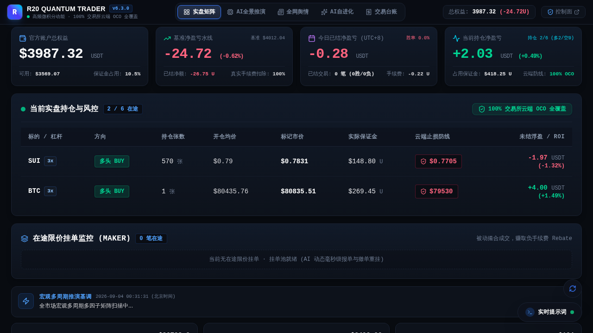
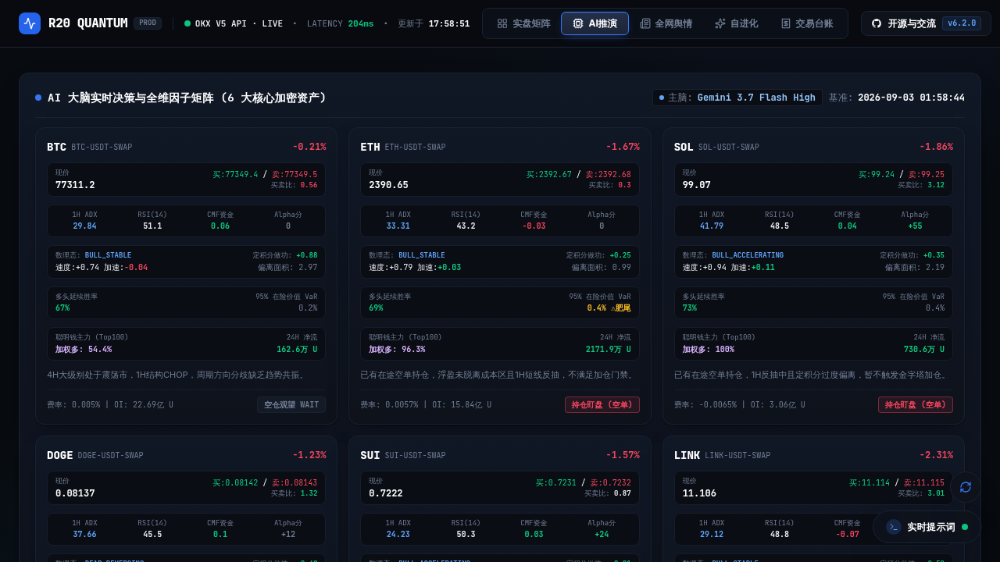
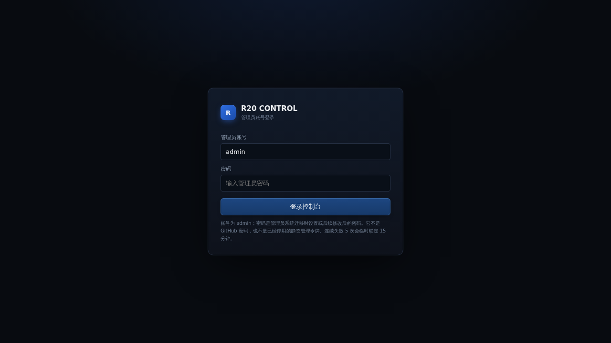

<div align="center">

# R20 Quantum Trader

### 面向 OKX 永续合约的 LLM 原生量化交易系统

**独立 Gateway · 多因子推演 · 极速内存直出 · 管理控制面 · QQ 官方 Bot 扫码绑定 · 模块化提示词 · 加密灾备**

[](https://github.com/555cute/r20-quantum-trader/releases/tag/v6.2.0)
[](#-交流群与社区支持)
[](https://linux.do/)
[](https://www.python.org/)
[](https://www.okx.com/)
[](#-验证与测试)
[](LICENSE)

[🌐 在线实盘大屏](https://www.r20.cn/) · [💬 QQ 交流群: 655973677](#-交流群与社区支持) · [🐧 LINUX DO 社区](https://linux.do/) · [🚀 独立部署指南](STANDALONE.md) · [📦 灾备恢复](RECOVERY_GUIDE.md)

</div>

---

### 💬 交流群与社区支持

欢迎各位量化交易者、AI 开发者与 LINUX DO 社区佬友加入交流！无论是实盘探讨、策略调优、Bug 反馈还是新特性建议，都欢迎进群交流：

| 渠道 | 链接 / 联系方式 | 说明 |
| :--- | :--- | :--- |
| 💬 **官方 QQ 交流群** | **`655973677`** | 核心交流群，第一时间获取策略调优、版本更新与实盘动态 |
| 👨‍💻 **作者 QQ** | **`1090188816`** | 商务合作、问题咨询与技术交流 |
| 🐧 **LINUX DO 社区** | [**linux.do**](https://linux.do/) | 社区开源认可、技术探讨与佬友交流 |
| 🌐 **实时在线大屏** | [**www.r20.cn**](https://www.r20.cn/) | 免登录查看当前 6 币种实盘矩阵与 AI 推演 |
| 🐛 **Issue / PR** | [**GitHub Issues**](https://github.com/555cute/r20-quantum-trader/issues) | 欢迎提交代码贡献、建议与使用反馈 |

---



> [!WARNING]
> R20 是研究型自动化量化交易开源项目，不构成任何投资建议，亦不承诺任何收益。强烈建议在 OKX **DEMO 模拟盘** 环境下完成策略验证、风控测试、QQ 扫码通知与灾备演练后，再评估是否接入实盘。

---

## 🌟 v6.2.0 正式版核心升级

R20 现已进入 **v6.2.0 正式版**，完成了前后端架构、交互体验、性能吞吐与通道连接的全方位跃升：

- ⚡ **内存预热直出架构（250x 极速秒开）**：
  彻底废除旧版串行阻塞式 HTTP 请求，引入后台多线程并行数据预热协程；`/api/all` 服务端响应耗时从 5,300ms 直降至 **17~23ms**，前台页面毫秒级秒开。
- 🐧 **QQ 官方 Bot 扫码一键绑定**：
  原生实现腾讯官方 `q.qq.com` Connector 协议，后台一键生成授权二维码，手机 QQ 扫码即自动完成本地 AES-256-GCM 密钥解密，**AppID、Secret、User OpenID 零手动复制即刻落盘加密库**。
- 🧭 **全场景自愈式刷新与 Hash 路由**：
  前台 5 大 Tab 与后台 13 个控制视图全量接入 Hash 路由（支持直链分享、前进后退、刷新保持）；引入递归防抖轮询与 `visibilitychange` 唤醒监听，切回网页即刻刷新。
- 🎛️ **HUD 核心指标卡 4 独立区域重构**：
  大屏顶部重构为 4 个独立的悬浮金融级卡片（总权益、累计净收益、今日已结盈亏、在途持仓浮盈），消除内部割裂横线，层级清晰。
- 🎯 **金融级十字准星光标（Crosshair Guide）**：
  Chart.js 走势图与盈亏柱状图全面集成点阵十字基准线，鼠标悬停时毫秒级吸附时间点与数值中轴。
- 🔄 **主页悬浮快速刷新按钮**：
  右下角常驻纯圆悬浮刷新按钮，支持一键触发全链路数据强制同步并带 360° 平滑旋转动效。

---

## 📸 产品界面展示

### 1. 实盘矩阵大屏（前台监控终端）
*官方账户总权益、净收益、今日战绩、持仓浮盈、在途限价挂单监控与云端 OCO 100% 保护状态一览无余，内置实时遥测时钟与状态呼吸灯。*


### 2. AI 全维因子推演矩阵
*覆盖因果微积分动力学（速度 $v$、加速度 $a$、冲量 $I$、加加速度 $j$）、定积分能量学（做功 $E$、偏离面积 $A$）、概率论延续度与 OKX Top100 聪明钱主力持仓均价及多空胜率。*



### 3. R20 Control 管理控制台
*PBKDF2 加盐安全认证、会话隔离门禁、模块化提示词编辑器、极简灾备归档中心与多频道通知中心。*



---

## 🛠️ 核心能力概览

| 模块维度 | 当前特性与规格 |
|---|---|
| **交易标的** | 默认覆盖 BTC、ETH、SOL、DOGE、SUI、LINK 六大主流高流动性合约，支持后台动态增删 |
| **数理基石** | 微积分动力学、定积分能量学、概率论风险评估（VaR / CVaR）、微观买卖盘口深度比 |
| **聪明钱透视** | OKX Top100 实盘主力加权多空占比、主力资金净流向、多头均价、空头均价与多空胜率 |
| **大模型大脑** | OpenAI 兼容接口（Gemini 3.7 Flash High / GPT-4o / Claude 3.5），输出严格合规 JSON 决策 |
| **交易执行层** | OKX V5 原生直签、Maker 限价低费率挂单、动态撤单重挂、100% 交易所云端 OCO 双向止盈止损 |
| **多通道通知** | **QQ 官方 Bot（支持手机扫码一键绑定）**、企业微信机器人、Telegram Bot、通用 Webhook |
| **多后端灾备** | Kopia 极简设计、scrypt + AES-256-GCM 强加密、定时自动快照、清单校验与只读演练 |
| **架构与性能** | FastAPI 异步控制面 + 内存预热直出（17ms 响应）+ 原生 Gateway Scheduler |

---

## 🚀 极速部署指南

### 1. 克隆代码仓库

```bash
git clone https://github.com/555cute/r20-quantum-trader.git
cd r20-quantum-trader
```

### 2. 运行自动化部署脚本

```bash
# 推荐一键部署：自动配置 Python 虚拟环境与依赖
./deploy/install.sh
```

或手动执行：

```bash
python3 -m venv .venv
source .venv/bin/activate
pip install -r requirements.txt
```

### 3. 环境变量配置

```bash
cp env.example .env
chmod 600 .env
```

配置核心参数：

```dotenv
# 大模型推演连接 (OpenAI 兼容接口)
LLM_BASE_URL=https://api.openai.com/v1
LLM_API_KEY=your_llm_api_key
LLM_MODEL=gemini-3.7-flash-high
LLM_REASONING_EFFORT=high

# 交易所环境选择 (demo 模拟盘 / live 实盘)
R20_OKX_ENV=demo
OKX_DEMO_API_KEY=
OKX_DEMO_SECRET_KEY=
OKX_DEMO_PASSPHRASE=

# 超级管理员初始化 Token
R20_SETUP_TOKEN=your_secure_random_token
```

### 4. 启动系统

```bash
# 启动统一管理后端与监控大屏
python3 -m uvicorn r20_backend.app:app --host 0.0.0.0 --port 8080
```

- 🌐 前台大屏：`http://localhost:8080/`
- 🎛️ 后台管理：`http://localhost:8080/admin`

---

## 🧪 验证与测试

系统内置完善的单元测试与回归测试套件，全面覆盖数理微积分、OKX 签名与交易服务、QQ 扫码加密解密、提示词管线与后台 API 鉴权：

```bash
# 运行全量 135 项自动化测试
python3 -m unittest discover -s tests
```

```text
----------------------------------------------------------------------
Ran 135 tests in 27.28s

OK
```

---

## 🤝 社区与致谢

- **🐧 LINUX DO 社区**：[linux.do](https://linux.do/)（感谢社区各位佬友的大力支持与开源认可！）
- **💬 QQ 官方交流群**：`655973677`
- **👨‍💻 作者 QQ**：`1090188816`
- **🐛 问题反馈**：[GitHub Issues](https://github.com/555cute/r20-quantum-trader/issues)

---

## 📄 开源许可证

本项目基于 [MIT License](LICENSE) 协议开源。
