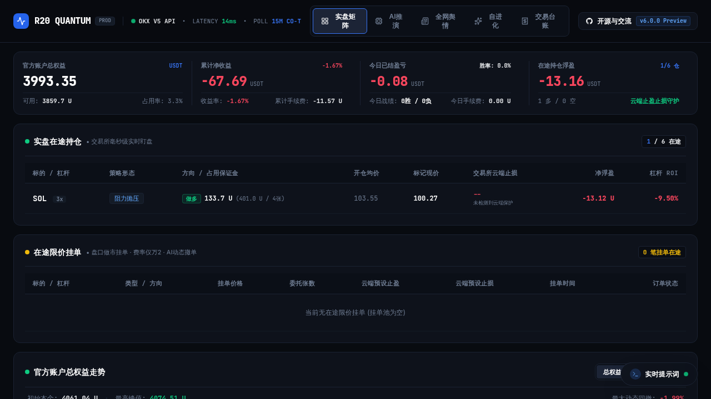
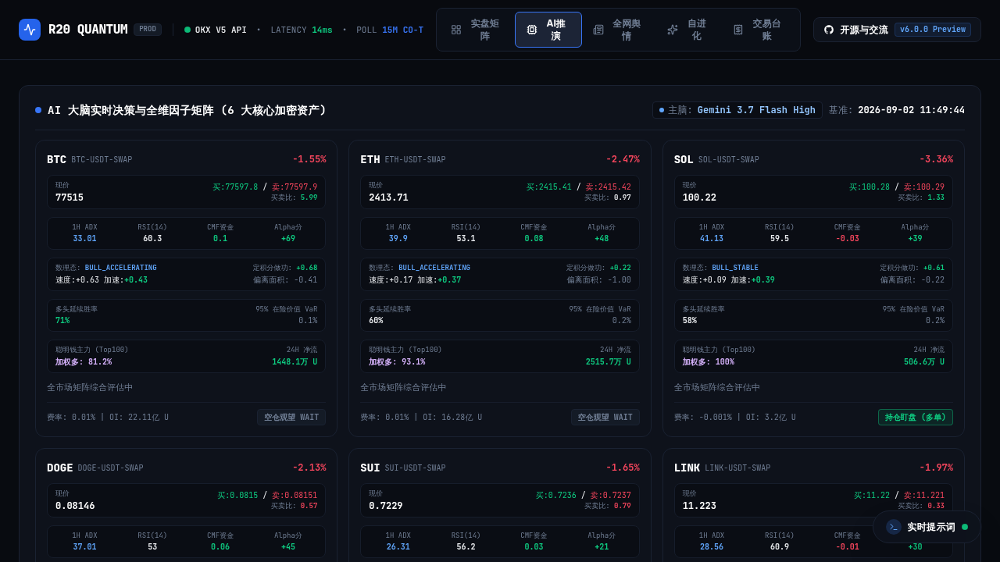
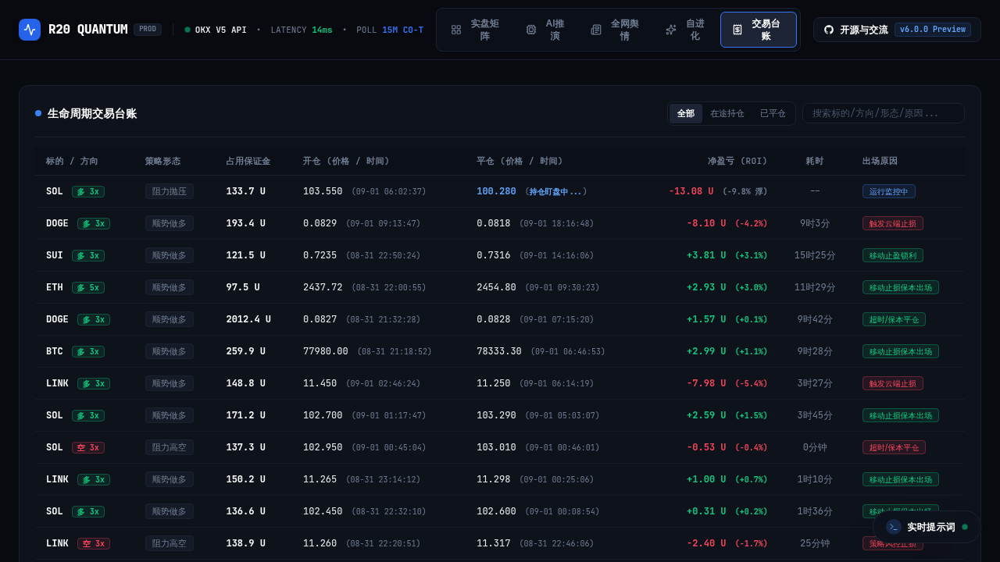
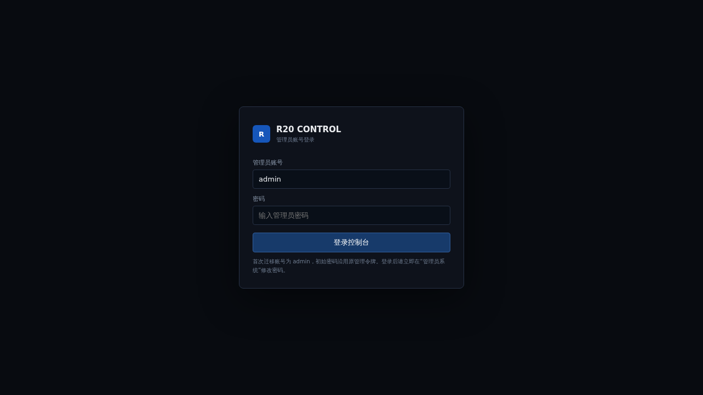
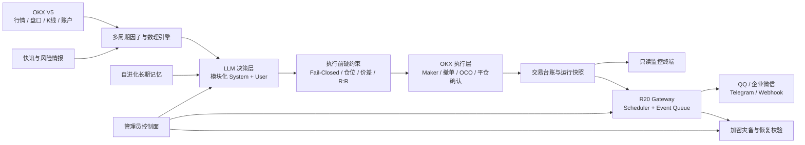

<div align="center">

# R20 Quantum Trader

### 面向 OKX 永续合约的 LLM 原生量化交易系统

**独立 Gateway · 多因子推演 · 交易执行 · 只读监控 · 管理控制面 · 多通道通知 · 加密灾备**

[](https://github.com/555cute/r20-quantum-trader/releases/tag/v6.0.0-preview)
[](https://www.python.org/)
[](https://www.okx.com/)
[](#验证与测试)
[](LICENSE)

[在线只读终端](https://www.r20.cn/) · [v6.0.0 Preview](https://github.com/555cute/r20-quantum-trader/releases/tag/v6.0.0-preview) · [独立部署](STANDALONE.md) · [恢复指南](RECOVERY_GUIDE.md)

</div>

---



> [!WARNING]
> R20 是研究型自动化交易项目，不构成投资建议，也不承诺收益。建议先使用 OKX **DEMO 模拟盘**完成配置、通知、止盈止损与故障恢复验证，再评估是否连接真实资金。

## v6.0.0 Preview 是什么

R20 把行情、数理因子、LLM 裁决、交易执行、通知、调度和灾备收敛到一套可审计的本地运行时中。公开 Web 端始终保持**只读监控**；所有敏感配置和受保护操作都放在独立管理员控制面中。

v6.0.0 Preview 的重点不是增加更多按钮，而是让关键链路更可控：

- **R20 原生 Gateway**：事件队列、通知投递、定时任务与 Worker 生命周期不再依赖外部 Agent 调度。
- **OKX LIVE / DEMO 隔离**：两套凭证独立保存；模拟盘请求自动携带 `x-simulated-trading: 1`。
- **模块化提示词管线**：交易 System、交易 User、自进化 System、自进化 User 分别由有序模块编译；P0、JSON 契约和实时数据模块受保护。
- **插件化灾备**：本地、S3、OSS、WebDAV/OpenList 与百度网盘官方 OAuth 等目标统一进入备份任务模型。
- **可靠通知通道**：QQ 官方 Bot、企业微信、Telegram 与通用 Webhook，可独立诊断、测试和启停。
- **Fail-Closed 执行边界**：持仓查询异常、流动性价差超限或必要保护缺失时，中止交易循环，而不是带病执行。

## 产品界面

### 实盘矩阵

官方账户权益、净收益、持仓浮盈、在途订单、云端保护和权益走势集中在一张高密度只读终端中。公开页面不提供开仓、平仓或修改配置入口。


### AI 全维因子矩阵

每个标的同时展示价格与盘口、ADX / RSI / CMF、微积分速度与加速度、定积分做功、条件延续概率、VaR，以及 Top100 聪明钱资金结构。



### 生命周期交易台账

统一记录方向、杠杆、策略形态、保证金、开平仓时间、净盈亏、持仓耗时和离场原因，支持在途与已平仓过滤。



### 独立管理员控制面

管理员页面采用账号密码与 PBKDF2-SHA256 会话认证，集中管理 Gateway、Agent、提示词、通知、灾备、OKX 环境和审计日志。敏感值仅显示配置状态，不回显原文。



## 核心能力

| 能力 | 当前实现 |
| --- | --- |
| 市场范围 | 默认 BTC、ETH、SOL、DOGE、SUI、LINK；后台共享币种池最多 6 个 |
| 时间框架 | 4H 宏观结构、1H 趋势与动力学、15M 执行辅助 |
| 数理引擎 | 速度、加速度、Jerk、定积分做功、VWAP 偏离面积、条件概率、VaR / CVaR |
| LLM 裁决 | OpenAI-compatible 接口；支持模型与 reasoning effort 配置 |
| 交易执行 | OKX V5、Maker 限价单、冲突订单清理、云端止盈止损、DEMO / LIVE 隔离 |
| 风险门禁 | 最大持仓数、单笔权益占比、单币种加仓次数、累计保证金、价差与查询 Fail-Closed |
| 自进化 | 根据真实交易结果生成带时间戳的长期策略记忆，并注入后续推演 |
| 通知 | QQ 官方 App Bot、企业微信、Telegram、通用 Webhook |
| 灾备 | 多任务、多目标、scrypt + AES-256-GCM、清单校验与只读恢复演练 |
| 运维 | FastAPI 控制面、Gateway Worker、SQLite 持久队列、审计日志、systemd 示例 |

## 系统架构



### 进程边界

```text
r20_backend.app       FastAPI 控制面 + 只读监控 API + 管理员认证
r20_gateway.worker    唯一调度所有者 + 持久事件投递 Worker
scripts/*             因子、AI 主脑、执行、自进化、台账和灾备任务
SQLite / data/*       Gateway 队列、管理员、快照与本地加密配置
```

> 不要同时运行旧 QwenPaw Cron、`r20_backend.scheduler` 和 `r20_gateway.worker`。v6 的调度所有者是 `r20_gateway.worker`。

## 快速开始

### 1. 克隆并安装

```bash
git clone https://github.com/555cute/r20-quantum-trader.git
cd r20-quantum-trader

# 推荐：同时安装 Python 依赖与官方 OKX CLI
./deploy/install.sh

# 或手动安装
python3 -m venv .venv
source .venv/bin/activate
pip install -r requirements.txt
npm install -g @okx_ai/okx-trade-cli@^1.4.4
```

### 2. 创建本地配置

```bash
cp env.example .env
chmod 600 .env
```

最小启动配置：

```dotenv
LLM_BASE_URL=https://api.openai.com/v1
LLM_API_KEY=replace_me
LLM_MODEL=your_model
LLM_REASONING_EFFORT=high

# 安全默认值：模拟盘
R20_OKX_ENV=demo
OKX_DEMO_API_KEY=
OKX_DEMO_SECRET_KEY=
OKX_DEMO_PASSPHRASE=

R20_SETUP_TOKEN=replace_with_a_long_random_setup_token
R20_MANUAL_CLOSE_ENABLED=0
```

首次部署推荐只配置 LLM 与 OKX DEMO。通知、提示词方案、灾备位置和管理员账号可在 `/admin` 中继续完成。

### 3. 配置 OKX（独立部署必做）

R20 的交易执行会直接调用官方 `okx` CLI，但**不会运行或依赖 QwenPaw Skill**。Skill 只是给聊天 Agent 阅读的操作说明；真正需要搬到新服务器的是：

1. 官方 OKX CLI；
2. R20 自己的环境选择和凭证；
3. 如果选择 OAuth，则必须由运行 R20 服务的同一 Linux 用户完成授权。

请从下面两种方式中选择一种，不要复制开发者或其他用户的 `.okx/`：

#### 方式 A：DEMO API Key（推荐用于 VPS 与长期无人值守）

在 OKX 的模拟交易 API 页面创建只允许交易和读取的 DEMO Key，然后登录 `/admin`，在“安全控制 → OKX 双环境凭证”填写 DEMO API Key、Secret 和 Passphrase。保持当前环境为 `DEMO`。

这种方式由 R20 本地加密 Secret Store 保存，最适合 systemd 服务；不要授予提币权限，建议绑定服务器出口 IP。

#### 方式 B：OKX CLI OAuth（适合个人单用户部署）

先确认服务运行用户和站点。站点必须由用户明确选择：`global`、`eea`、`us` 或 `tr`，不能静默默认。

```bash
# 以下命令必须由运行 r20-backend 与 r20-gateway 的同一 Linux 用户执行
okx config show --json
okx auth status --json
okx auth login --manual --site global   # 按你的实际站点替换 global
```

CLI 会返回浏览器授权地址和验证码。授权完成后，不要关注短期 access token 的 TTL；CLI 会自动刷新。随后执行只读预检：

```bash
.venv/bin/python scripts/r20_okx_setup.py
```

只有显示 `READY` 才能启动 Gateway。R20 会在当前环境缺少 `read`/`trade` 授权、CLI 不可见或私有读取失败时标记为不可运行。

> OAuth 状态保存在运行用户的 `~/.okx/`。该目录是本地私有状态，已被 Git 忽略，不能提交到仓库或直接分发给新用户。systemd 的 `User`、`HOME` 和 `PATH` 必须与完成 OAuth 登录的用户一致。

### 4. 启动控制面

```bash
source .venv/bin/activate
python3 -m uvicorn r20_backend.app:app --host 0.0.0.0 --port 8080
```

访问：

- 只读终端：`http://127.0.0.1:8080/`
- 管理后台：`http://127.0.0.1:8080/admin`
- 健康检查：`http://127.0.0.1:8080/api/v1/health`

### 5. 启动唯一 Gateway Worker

另开终端：

```bash
source .venv/bin/activate
python3 -m r20_gateway.worker
```

生产环境可使用：

- [`deploy/r20-quantum.service`](deploy/r20-quantum.service)
- [`deploy/r20-gateway.service`](deploy/r20-gateway.service)

完整迁移与 systemd 操作见 [`STANDALONE.md`](STANDALONE.md)。

## 配置原则

### OKX 环境

- 默认使用 `R20_OKX_ENV=demo`。
- LIVE 与 DEMO API Key 必须分别创建和保存；或使用同一服务用户下的 OKX CLI OAuth。
- R20 不依赖 QwenPaw Skill，但当前交易执行依赖官方 `okx` CLI；安装后可在后台查看 CLI、OAuth、权限和只读探针状态。
- Web 监控、策略执行、台账同步和管理员快速平仓共享同一环境选择器。
- 手动快速平仓默认关闭；开启后仍需管理员密码、一次性 Token 和精确确认短语。

### 提示词

提示词库直接编辑四条实际消息管线：

1. 交易 System
2. 交易 User
3. 自进化 System
4. 自进化 User

系统会锁定或 Fail-Closed 保护 P0、输出 JSON 契约与执行层硬约束。运行时模块匹配失败时，实时行情输入不能被静默丢弃。

### 通知

各通道独立启用、独立诊断、独立测试。测试发送需要明确确认短语；“仅诊断”不会外发消息。

个人微信通知不属于 R20 的可用通道。请使用 QQ、Telegram、企业微信或 Webhook，并至少启用两个彼此独立的通道承接关键告警。

### 灾备

简化模式只需要选择备份内容、保存位置、执行时间和保留份数；高级模式支持多目标、排除规则、加密、清单验证和恢复演练。密钥只保存到本地 Secret Store，不应进入 Git。

## 风险控制与安全边界

- 公开监控页面仅提供 GET 型只读能力，不放置交易按钮。
- 私有账本、`.okx/`、Token、API Key、反向代理地址和本地数据库均由 `.gitignore` 隔离。
- Secret Store 使用本机加密密钥；后台不回显完整敏感值。
- 持仓读取异常或流动性价差大于策略阈值时立即终止交易循环。
- 平仓流程要求撤销冲突委托、提交 reduce-only / close 请求并核验真实撮合结果。
- 开仓后应保持交易所云端止盈止损覆盖；本地服务离线不能成为裸仓理由。
- 所有时间调度与日报统计统一使用北京时间 `Asia/Shanghai`。

## 验证与测试

v6.0.0 Preview 发布候选已通过：

```bash
python3 -m compileall -q r20_backend r20_gateway scripts
python3 -m unittest discover -s tests -v
```

当前结果：**103 / 103 tests passed**。

测试覆盖管理员认证、提示词模块保护、Gateway 调度与持久队列、插件注册、灾备、OKX 控制面、通知通道业务码和数理因子等关键路径。真实交易、真实通知和灾备目标仍必须在部署者自己的 DEMO 环境中逐项验收。

## 项目结构

```text
r20-quantum-trader/
├── r20_backend/          # FastAPI、管理员认证、控制面、通知与 OKX 服务
├── r20_gateway/          # Scheduler、事件队列、Worker、插件与遥测
├── scripts/              # AI、因子、交易执行、自进化、同步与灾备任务
├── dashboard/            # 机构级只读 Web 终端
├── data/                 # 本地运行数据；敏感文件默认不提交
├── deploy/               # systemd 服务示例
├── docs/images/          # README 与发布截图
├── tests/                # 自动化测试
├── env.example           # 无密钥配置模板
├── STANDALONE.md         # 独立部署说明
└── RECOVERY_GUIDE.md     # 灾备与恢复指南
```

## 版本与路线

当前公开版本：[`v6.0.0-preview`](https://github.com/555cute/r20-quantum-trader/releases/tag/v6.0.0-preview)

Preview 阶段重点验证：

- Gateway 在移除外部 Cron 后的长期调度稳定性；
- OKX DEMO / LIVE 切换和交易操作的 Fail-Closed 行为；
- 多通知通道在真实网络环境中的受理与最终到达差异；
- 多目标灾备、归档校验和只读恢复演练；
- 桌面端与移动端管理员控制面的可用性。

## 社区

- QQ 交流群：`655973677`
- 作者 QQ：`1090188816`
- LINUX DO：[linux.do](https://linux.do/)
- 问题与建议：[GitHub Issues](https://github.com/555cute/r20-quantum-trader/issues)

## License

[MIT License](LICENSE)

---

<div align="center">

**R20 Quantum Trader · Build observable systems before trusting autonomous systems.**

</div>
